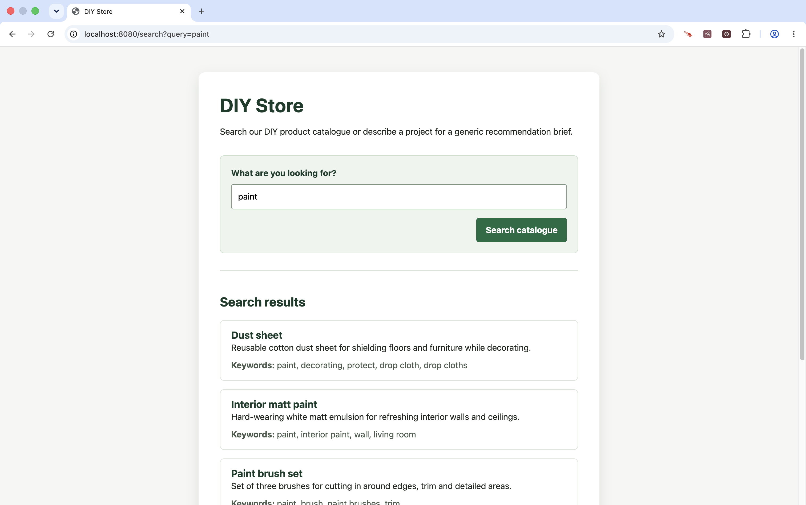
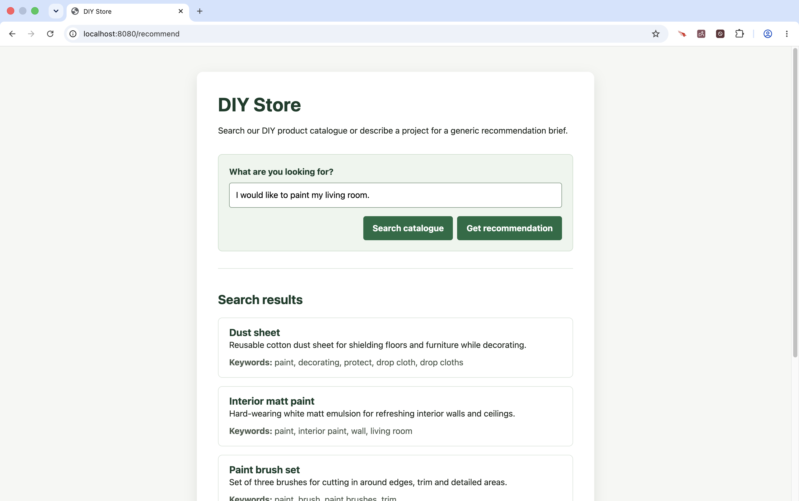

<!-- Generated by Sociable Weaver (https://github.com/albertattard/sw). Manual edits will be overwritten when regenerated. -->

# Demo - DIY Store

This project builds a small DIY-store web application step by step. It starts
with a conventional Spring Web and Thymeleaf product search backed by a small H2
catalogue.

The starter application deliberately contains no AI. Each subsequent checkpoint
adds one capability through a fixture. Apply the fixtures in order: each builds
on the changes made by the previous one.

Structured chat first translates a customer’s natural-language DIY request into
a generic recommendation brief, whose categories drive a conventional catalogue
search. The next checkpoint adds photo inference, which identifies candidate DIY
tasks from an uploaded image. An LLM-as-a-judge checkpoint then reviews those
task choices before they are shown to the customer.

Retrieval then improves catalogue matching with semantic search. Finally, local
tool calling lets the model query the application-owned catalogue when selecting
products. The example makes the progression explicit: capture customer intent,
ground recommendations in catalogue data, review customer-facing output, and
give the model bounded access to operational information.

---

## Disclaimer

The examples provided in this repository are for **educational purposes only**
and are intended to be used **exclusively within this workshop**. While every
effort has been made to ensure accuracy and reliability, these examples are
provided **“as is”**, without any warranties, express or implied.

By using these examples, you acknowledge that you do so **at your own risk**.
The authors and contributors shall **not be held liable** for any direct,
indirect, incidental, or consequential damages resulting from the use, misuse,
or inability to use these examples.

It is the responsibility of the user to **review, test, and validate** any code
before applying it in a production or commercial environment.

### Performance Disclaimer

The performance values shown in this workshop are for reference only and should
not be treated as absolute. Results can vary depending on hardware, system
configuration, runtime environment, and other factors. Readers are encouraged to
conduct their own tests under controlled conditions to obtain accurate
measurements relevant to their specific use case.

---

## Learning objectives

By the end of this example, attendees can:

- explain how structured chat turns a natural-language DIY request into a
  recommendation brief;
- explain how a vision model can infer candidate DIY tasks from a photo;
- distinguish model-generated generic product types from catalogue-backed product
  recommendations;
- explain why an LLM judge is an output guardrail rather than proof of safety;
- describe how semantic retrieval can improve catalogue matching; and
- explain how local tool calling lets a model query application-owned catalogue
  data when selecting products.

## Prerequisites and environment

- [Oracle Java 25](https://www.oracle.com/java/technologies/downloads/#java25)

- [rsync](https://rsync.samba.org/)

- [OpenAI API Key](https://platform.openai.com/api-keys)

H2 runs in the application process. No database server or database account is
required. To call OpenAI, create `~/.openai/openai-api.yml` with the
`spring.ai.openai.api-key` property. The application imports that file when it
is present; never add an API key to this repository.

OpenAI calls are paid, and their output can vary between runs and model
versions. The MVC tests do not call OpenAI and therefore run without a key.

## The starter project

The starter project is a conventional server-rendered Spring Web and Thymeleaf
DIY store backed by a small H2 catalogue. A customer enters a product term and
sees matching catalogue products.

`DiyStoreController` validates the request and coordinates the search.
`ProductService` delegates to `ProductRepository`, which performs a
case-insensitive literal match against product names and keywords.
`templates/index.html` renders the search form and results.

There is no AI integration in the starter project. The first fixture,
`fixtures/01-chat/`, adds a structured-chat recommendation path: it turns a
natural-language DIY request into generic product types, then uses those types
to search the catalogue.

## Guided walkthrough

Work through the following steps in order. First, run the conventional starter
application to establish the existing product-search journey. Then apply the
structured-chat fixture and repeat the journey with a natural-language DIY
request.

The build and test commands do not call OpenAI. An API key is needed only when
you start the structured-chat application and submit a recommendation request.

### Run the current Application

Run the conventional application first to establish the baseline product-search
journey before adding any AI capabilities.

1. Build and verify the current application.

  This performs a clean build and runs the automated tests for the conventional
  catalogue-search journey.

   ```shell
   ./mvnw clean verify
   ```

2. Start the application.

  The command runs the packaged application in the background and waits until
  the home page is available.

   ```shell
   # Start the application in the background
   java -jar 'target/demo-diy-store-1.0.0.jar' > './target/application.log' 2>&1 &

   # Capture its PID so that we can stop the application using it
   echo "$!" > './target/application.pid'

   # Wait for the application to become ready
   for attempt in {1..20}; do
     if curl --fail --silent --output /dev/null http://localhost:8080/; then
       break
     fi
     sleep 1
   done

   # Verify that the application is ready
   curl --fail --silent --output /dev/null http://localhost:8080/
   ```

3. Open [http://localhost:8080](http://localhost:8080) in a browser.

  Search for `paint` and confirm that the catalogue returns matching products,
  such as “Interior matt paint” and “Paint roller set”.

  

  At this point the search matches literal product names and keywords only; it
  does not yet understand a DIY project request.

4. Stop the application to free port 8080 before applying the first fixture.

   ```shell
   kill "$(cat './target/application.pid')" 2>/dev/null
   ```

### Step 1 - First AI integration

This first checkpoint adds a structured-chat recommendation path to the
conventional catalogue search. A customer can describe a DIY project in natural
language. The model returns generic product categories, which the application
uses to search the local catalogue and present matching products.

1. Apply the structured-chat checkpoint.

   The command merges `fixtures/01-chat/` into the project without deleting
   existing files. Inspect the fixture before copying it so that each addition
   and replacement remains visible during the workshop.

   ```shell
   rsync --archive fixtures/01-chat/ ./
   ```

2. Build and test the application.

   The MVC tests cover the initial page, shared input validation, catalogue
   search, and rendering a mocked structured recommendation. No OpenAI
   credentials or paid requests are needed.

   ```shell
   ./mvnw clean verify
   ```

3. Configure OpenAI before starting the application if you want to submit a
   recommendation. The following example shows the expected local file shape;
   replace the placeholder locally and do not commit the file:

   ```yaml
   spring:
     ai:
       openai:
         api-key: ${OPENAI_API_KEY}
   ```

   Set `OPENAI_API_KEY` in your shell before starting the application. Each
   recommendation submission makes a paid OpenAI chat request.

4. Start the local Spring Boot application.

   The command runs it in the background and waits until the home page is
   available.

   ```shell
   # Start the application in the background
   java -jar 'target/demo-diy-store-1.0.0.jar' > './target/application.log' 2>&1 &

   # Capture its PID so that we can stop the application using it
   echo "$!" > './target/application.pid'

   # Wait for the application to become ready
   for attempt in {1..20}; do
     if curl --fail --silent --output /dev/null http://localhost:8080/; then
       break
     fi
     sleep 1
   done

   # Verify that the application is ready
   curl --fail --silent --output /dev/null http://localhost:8080/
   ```

5. Open [http://localhost:8080](http://localhost:8080) in a browser.

   Enter `I would like to paint my living room.` and select
   **Get recommendation**. The application asks the model for generic product
   categories, then searches the catalogue for each category. The results should
   contain products suitable for painting a living room. Exact category and
   product choices can vary between requests.

   

6. Stop the application to free port 8080 before continuing to the next
   checkpoint.

   ```shell
   kill "$(cat './target/application.pid')" 2>/dev/null
   ```

### Step 2 - Upload photos

This checkpoint adds image-based task inference. A customer can upload a JPEG
photo of a DIY problem, and a vision-capable model suggests candidate tasks
before the customer selects one to receive catalogue-backed product recommendations.

1. Apply the image-inference checkpoint.

   The command merges `fixtures/02-image/` into the project without deleting
   existing files. Inspect the fixture before copying it so that each addition
   and replacement remains visible during the workshop.

   ```shell
   rsync --archive fixtures/02-image/ ./
   ```

2. Build and test the application.

   The MVC tests cover empty, unsupported, and oversized uploads plus rendering
   a mocked task-inference result. No OpenAI credentials or paid requests are
   needed.

   ```shell
   ./mvnw clean verify
   ```

3. The image form accepts JPEG photos up to 5 MB.

   Before the model receives a photo larger than 1,024 pixels on its longest
   edge, the application resizes it while preserving its aspect ratio. Uploads
   are kept only for the request and are never persisted. Configure OpenAI as in
   Step 1 before starting the application. This checkpoint requires the
   vision-capable `gpt-4o-mini` model configured in `application.yml`; each
   upload makes a paid vision request and the inferred tasks can vary between
   requests. Selecting a task makes the paid chat recommendation request
   introduced in Step 1.

   The workshop resizer deliberately does not apply JPEG EXIF orientation
   metadata. A phone photo that needs resizing may therefore be sent sideways.
   Production code should apply that orientation before resizing and sending the
   image.

4. Start the local Spring Boot application.

   The command runs it in the background and waits until the home page is
   available.

   ```shell
   # Start the application in the background
   java -jar 'target/demo-diy-store-1.0.0.jar' > './target/application.log' 2>&1 &

   # Capture its PID so that we can stop the application using it
   echo "$!" > './target/application.pid'

   # Wait for the application to become ready
   for attempt in {1..20}; do
     if curl --fail --silent --output /dev/null http://localhost:8080/; then
       break
     fi
     sleep 1
   done

   # Verify that the application is ready
   curl --fail --silent --output /dev/null http://localhost:8080/
   ```

5. Open [http://localhost:8080](http://localhost:8080) in a browser.

   Upload a suitable JPEG photo of a DIY problem and select
   **Identify DIY tasks**. The application should show one or more candidate
   tasks. Select one to request the catalogue-backed product recommendations.

   A photo without useful DIY context should show “No supported DIY task could
   be identified from this photo.”

6. Stop the application to free port 8080 before continuing to the next
   checkpoint.

   ```shell
   kill "$(cat './target/application.pid')" 2>/dev/null
   ```

### Step 3 - Review task choices with an LLM judge

This checkpoint adds an LLM judge after image-based task inference. The judge
checks whether the proposed tasks satisfy a narrow policy before they are shown
to the customer. If the judge rejects them or does not return a decision, the
application displays a fixed fallback rather than model-generated alternatives.

1. Apply the LLM-as-a-judge checkpoint.

   The command merges `fixtures/03-judge/` into the project without deleting
   existing files. The fixture adds a separate model call after visual task
   inference, plus a fixed fallback that is displayed when the judge rejects the
   proposed task choices.

   ```shell
   rsync --archive fixtures/03-judge/ ./
   ```

2. Build and test the application.

   The tests mock the vision and judge calls. They prove that a passed decision
   preserves the original task choices and that a rejected choice is absent from
   the rendered page. No OpenAI credentials or paid requests are needed.

   ```shell
   ./mvnw clean verify
   ```

3. The judge is a second paid chat request, made only after a supported image
   produces one or more task choices. Its prompt has a deliberately narrow
   policy: a choice must be a supported DIY task and must not contain
   inappropriate content, catalogue products, or SKUs. The judge returns only a
   `PASSED` or `REJECTED` decision and a short reason for application logs. The
   application owns the fallback text; it never shows rejected choices or the
   judge’s explanation.

   This fixture continues to use the `gpt-4o-mini` model configured in
   `application.yml`. Configure OpenAI as in Step 1 before starting the
   application. Each supported upload now makes a paid vision request and a paid
   judge request. Selecting a passed task then makes the paid chat
   recommendation request introduced in Step 1.

4. Start the local Spring Boot application.

   The command runs it in the background and waits until the home page is
   available.

   ```shell
   # Start the application in the background
   java -jar 'target/demo-diy-store-1.0.0.jar' > './target/application.log' 2>&1 &

   # Capture its PID so that we can stop the application using it
   echo "$!" > './target/application.pid'

   # Wait for the application to become ready
   for attempt in {1..20}; do
     if curl --fail --silent --output /dev/null http://localhost:8080/; then
       break
     fi
     sleep 1
   done

   # Verify that the application is ready
   curl --fail --silent --output /dev/null http://localhost:8080/
   ```

5. Open [http://localhost:8080](http://localhost:8080) in a browser.

   Upload a suitable JPEG photo and select **Identify DIY tasks**. When the
   judge passes the inferred tasks, the application shows them as selectable
   buttons. Select one to continue to the catalogue-backed recommendation flow.

   The normal browser journey cannot reliably force a rejection. Use the mocked
   MVC test to inspect the deterministic fallback path.

6. Stop the application to free port 8080 before continuing to the next
   checkpoint.

   ```shell
   kill "$(cat './target/application.pid')" 2>/dev/null
   ```

### Step 4 - Ground recommendations with RAG

This checkpoint grounds recommendations in catalogue data with
retrieval-augmented generation (RAG). The application indexes the H2 catalogue
in an in-memory vector store, then uses semantic retrieval to find products that
match the customer’s intended DIY task rather than only literal keywords.

1. Apply the RAG checkpoint.

   The fixture converts the existing H2 catalogue into documents and loads them
   into an in-memory `SimpleVectorStore` at application startup. The
   customer-facing page is unchanged.

   ```shell
   rsync --archive fixtures/04-rag/ ./
   ```

2. Build and test the application.


   The RAG tests convert the fixture catalogue into documents, preserve the
   existing product-results view, and reject a model recommendation containing
   an ID that was not retrieved. The test configuration disables the catalogue
   load, so no OpenAI request is made during the build.

   ```shell
   ./mvnw clean verify
   ```

3. This checkpoint uses both `gpt-4o-mini` for chat and `text-embedding-3-small`
  for embeddings, as configured in `application.yml`. Configure OpenAI as in
  Step 1 before starting the application. Starting the application embeds the
  H2 catalogue, and every generated retrieval query makes an embedding request.

  A recommendation makes one chat request to turn the customer’s request into
  retrieval-friendly queries. When that structured response marks the request
  as unsupported, no vector search is made. Otherwise, a second chat request
  selects product IDs only from the retrieved documents. The application
  rejects the whole recommendation when the model returns an ID that was not
  retrieved, then fetches the accepted IDs from H2 and renders the existing
  product-results view. All OpenAI requests are paid and their output can vary
  between runs.

4. Start the local Spring Boot application:

   ```shell
   # Start the application in the background
   java -jar 'target/demo-diy-store-1.0.0.jar' > './target/application.log' 2>&1 &

   # Capture its PID so that we can stop the application using it
   echo "$!" > './target/application.pid'

   # Wait for the application to become ready
   for attempt in {1..20}; do
     if curl --fail --silent --output /dev/null http://localhost:8080/; then
       break
     fi
     sleep 1
   done

   # Verify that the application is ready
   curl --fail --silent --output /dev/null http://localhost:8080/
   ```

5. Open [http://localhost:8080](http://localhost:8080), enter
   `I would like to paint my living room.`, and select **Get recommendation**.
   The page shows the same product-results view as earlier checkpoints, but the
   recommendation is now based on semantic retrieval and validated product IDs.
   Results can vary because retrieval depends on the embedding model, the
   catalogue descriptions, the generated queries, and the top-five limit.

6. Stop the application

   ```shell
   kill "$(cat './target/application.pid')" 2>/dev/null
   ```

### Step 5 - Call the local catalogue tool

This checkpoint lets the model call an application-owned catalogue tool while
selecting products. The `search_catalogue` tool runs locally inside the DIY
Store application; it is not an MCP integration. The application validates the
returned product IDs before displaying any recommendations.

1. Apply the local-tool-calling checkpoint.

  This is not an MCP example: the `search_catalogue` tool runs inside the DIY
  Store application. The model can ask it to search the in-memory vector store
  before selecting catalogue product IDs.

   ```shell
   rsync --archive fixtures/05-tools/ ./
   ```

2. Build and test the application.

  The tests mock the tool-calling interaction and verify that the model
  receives only the customer question before it calls `search_catalogue`. They
  reject an ID outside the application’s catalogue retrieval and prove that
  only an ID returned by application-owned catalogue retrieval reaches the
  existing product-results view. No OpenAI credentials or paid requests are
  needed.

   ```shell
   ./mvnw clean verify
   ```

3. This checkpoint still uses `gpt-4o-mini` for chat and
  `text-embedding-3-small` for the `SimpleVectorStore`, as configured in
  `application.yml`. Configure OpenAI as in Step 1 before starting the
  application. Start it with `-Ddemo.tools.enabled=true` to replace the default
  RAG recommendation flow with local tool calling. The model decides whether
  and when to invoke `search_catalogue`; this is non-deterministic. Each
  catalogue search makes a paid embedding request, and the tool-calling
  exchange makes paid chat requests. The application logs each local tool’s
  name and returned data, then renders only products with verified catalogue
  IDs.

4. Start the local Spring Boot application with tool calling enabled.

  Open [http://localhost:8080](http://localhost:8080), enter
  `What do I need to paint my living room?`, and select **Get recommendation**.
  Inspect the application log to see the model-selected tool calls. The normal
  path should search the catalogue before using any product ID.

   ```shell
   # Start the application in the background
   java -Ddemo.tools.enabled=true -jar 'target/demo-diy-store-1.0.0.jar' > './target/application.log' 2>&1 &

   # Capture its PID so that we can stop the application using it
   echo "$!" > './target/application.pid'

   # Wait for the application to become ready
   for attempt in {1..20}; do
     if curl --fail --silent --output /dev/null http://localhost:8080/; then
       break
     fi
     sleep 1
   done

   # Verify that the application is ready
   curl --fail --silent --output /dev/null http://localhost:8080/
   ```

5. Stop the application

   ```shell
   kill "$(cat './target/application.pid')" 2>/dev/null
   ```

### Restore the changes

Each fixture changes the project in place, and later checkpoints build on
earlier ones. Use the following commands only when you are ready to discard the
workshop changes and return to the starter project. If you have made your own
changes, inspect and save or stash them first.

```shell
# Restore tracked files changed by the checkpoints.
git restore --source=HEAD --staged --worktree -- pom.xml src

# Remove untracked source files added by the checkpoints.
git clean --force -d -- src
```

## Interpretation and limitations

The image form proves that a vision-capable model can infer a small,
application-owned set of plausible DIY tasks from visual evidence. It does not
know which products the store stocks, and a photo can be ambiguous, incomplete,
or unrelated to DIY. The LLM-as-a-judge step can reject unsuitable task choices
before customers see them, but it is non-deterministic and can make both
false-positive and false-negative decisions. It is not evidence that the choices
are safe, correct, lawful, or suitable for every audience, and it does not
replace policy enforcement, human review, or domain-specific safeguards.

A passed customer choice still enters the existing structured-chat flow, which
finds catalogue-backed products. The final checkpoint lets the model decide when
to use local tools for catalogue retrieval and operational information.

Local tool calling is not MCP. These methods run in the same application process
as the web interface, share its deployment boundary and failure domain, and use
application-owned demo operational values. A separate MCP server and client
would be needed to demonstrate protocol interoperability.

In a production-oriented optimisation, the vision call could return each task
together with generic product categories. The selected task could then search
the catalogue directly, removing one model request and reducing latency and
cost. This example deliberately does not do that: keeping visual inference and
the existing text-to-category chat flow separate makes their composition visible
during the workshop.

## References

- [Spring MVC form handling](https://docs.spring.io/spring-framework/reference/web/webmvc/mvc-controller/ann-methods/modelattrib-method-args.html)
- [Thymeleaf + Spring](https://www.thymeleaf.org/doc/tutorials/3.1/thymeleafspring.html)
- [Spring AI ChatClient](https://docs.spring.io/spring-ai/reference/api/chatclient.html)
- [Spring AI tool calling](https://docs.spring.io/spring-ai/reference/api/tools.html)
