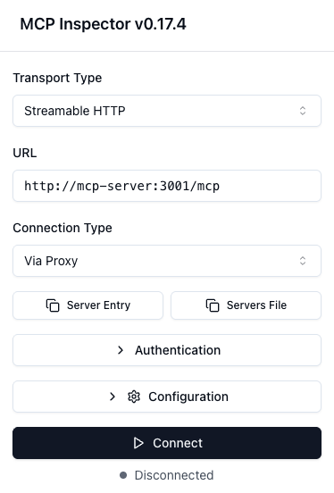
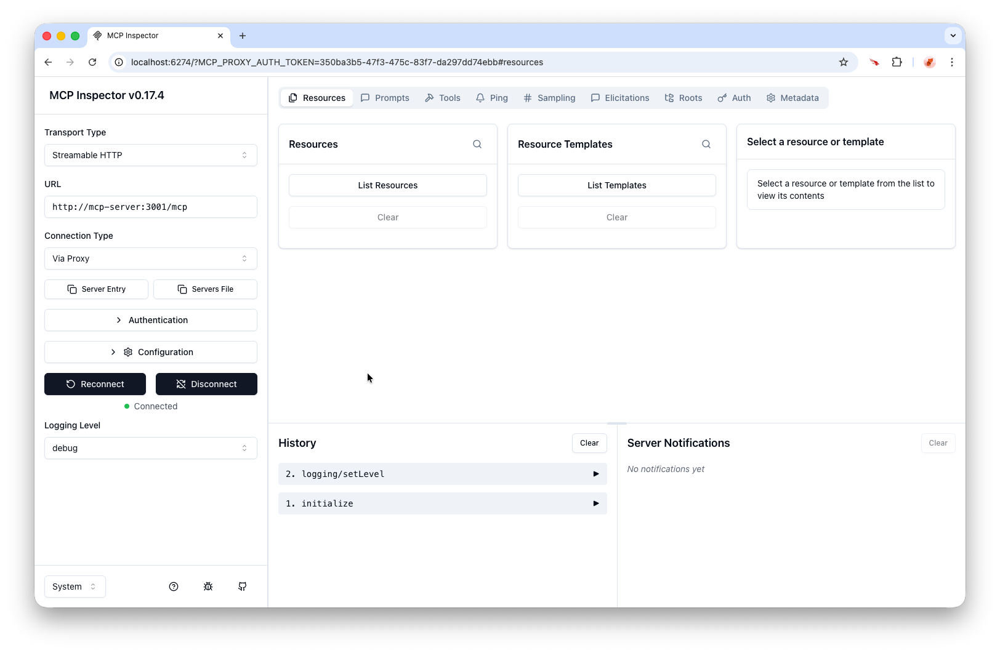

<!-- Generated by Sociable Weaver (https://github.com/albertattard/sw). Manual edits will be overwritten when regenerated. -->

# MCP Server - Spring AI and ChatGPT API

This example illustrates how to expose tools to a
[Model Context Protocol (MCP)](https://modelcontextprotocol.io/) server. While
MCP shows considerable promise, it also introduces notable security risks. For
instance, a malicious user could potentially trigger harmful actions, or the
model may misinterpret a prompt and carry out unintended operations, such as
deleting files.

With every request, MCP provides the model with a list of available tools, after
which the model decides whether to invoke any of them. These tool definitions
contribute to the overall prompt size, and an excessively large list can
adversely affect model performance. Rather than supplying all tools with every
request, it is preferable to limit the toolset to those that are directly
relevant to the specific prompt.

This example uses [Spring AI](https://spring.io/projects/spring-ai), a
Java-based framework for building applications powered by large language models
(LLMs). It offers capabilities such as prompt management, LLM call chaining,
memory handling, retrieval-augmented generation (RAG)—which improves responses
by incorporating external knowledge—and integration with external data sources,
all within the Java ecosystem.

[LangChain4J](https://github.com/langchain4j/langchain4j) is an alternative
framework that also provides an abstraction layer between LLMs and the
application.

**References**

- [Streamable-HTTP MCP Servers](https://docs.spring.io/spring-ai/reference/api/mcp/mcp-streamable-http-server-boot-starter-docs.html)

---

## Disclaimer

The examples provided in this repository are for **educational purposes only**
and are intended to be used **exclusively within this workshop**. While every
effort has been made to ensure accuracy and reliability, these examples are
provided **“as is”**, without any warranties, express or implied.

By using these examples, you acknowledge that you do so **at your own risk**.
The authors and contributors shall **not be held liable** for any direct,
indirect, incidental, or consequential damages resulting from the use, misuse,
or inability to use these examples.

It is the responsibility of the user to **review, test, and validate** any code
before applying it in a production or commercial environment.

### Performance Disclaimer

The performance values shown in this workshop are for reference only and should
not be treated as absolute. Results can vary depending on hardware, system
configuration, runtime environment, and other factors. Readers are encouraged to
conduct their own tests under controlled conditions to obtain accurate
measurements relevant to their specific use case.

---

## Prerequisites

- [Oracle Java 25](https://www.oracle.com/java/technologies/downloads/#java25)

-  Container runtime, such as [colima](https://github.com/abiosoft/colima) or
   [Podman](https://podman.io/)

## Run the example

1. Build the application

   ```shell
   ./mvnw clean verify
   ```

   (*Optional*) Verify that the application was created.

   ```shell
   tree --prune --sort=name -L 1 './target'
   ```

   The application Fat JAR file

   ```
   ./target
   ├── mcp-server-streamable-http-springai-1.0.0.jar
   └── mcp-server-streamable-http-springai-1.0.0.jar.original

   1 directory, 2 files
   ```

2. Build and run the MCP inspector and the MCP Server

   There are several ways to run the MCP Inspector and the MCP server. Using Docker ensures that
   all required dependencies and configurations are set up correctly and
   consistently.

   ```shell
   docker compose --file './infrastructure/compose.yml' up --build --detach
   ```

   This will start the MCP Inspector and the MCP Server in the background. Allow a few seconds for
   it to initialise, then access it via your browser at the following address:
   [http://localhost:6274/?MCP_PROXY_AUTH_TOKEN=350ba3b5-47f3-475c-83f7-da297dd74ebb#tools](http://localhost:6274/?MCP_PROXY_AUTH_TOKEN=350ba3b5-47f3-475c-83f7-da297dd74ebb#tools).

   ```shell
   open 'http://localhost:6274/?MCP_PROXY_AUTH_TOKEN=350ba3b5-47f3-475c-83f7-da297dd74ebb#tools'
   ```

   Set the **Transport Type** to _Streamable HTTP_, enter
   _http://mcp-server:3001/mcp_ in the **URL** field.

   

   Then select **Connect** to launch the Java application and establish a
   connection using the MCP Streamable HTTP protocol.

   

   Navigate to the **Tools** tab and click on **List Tools** button to see all
   the tools available.

   

   Select the function to execute, enter the required parameters, and click the
   **Run Tool** button.

   

3. Stop the MCP inspector when ready

   ```shell
   docker compose --file './infrastructure/compose.yml' down
   ```
