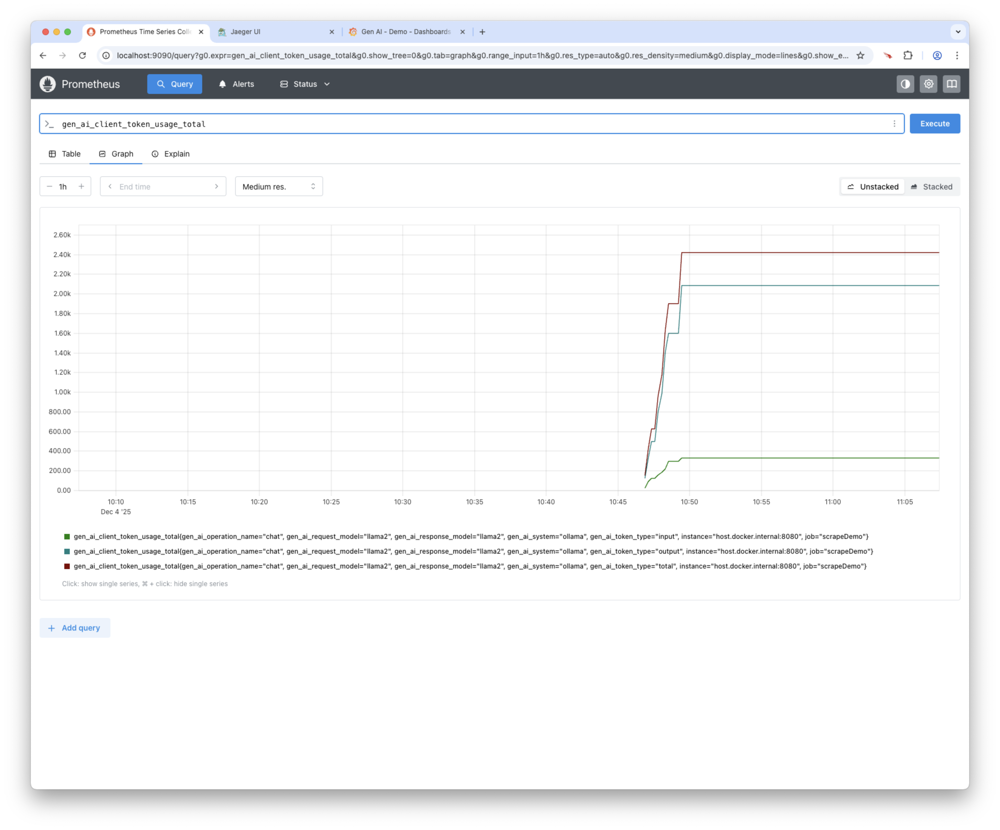
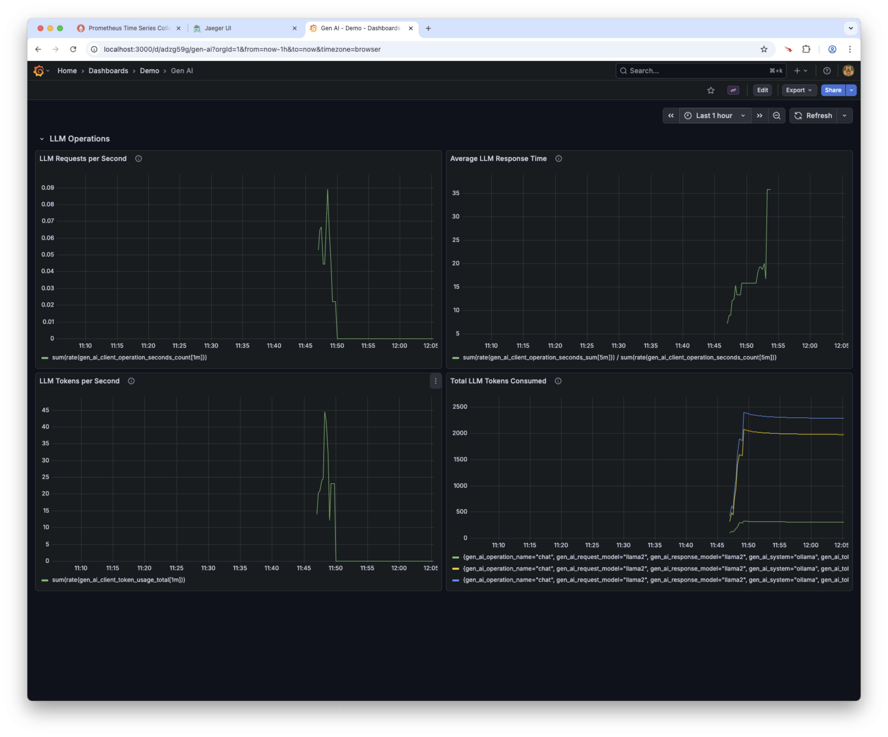

<!-- Generated by Sociable Weaver (https://github.com/albertattard/sw). Manual edits will be overwritten when regenerated. -->

# Observability - Spring AI and Ollama API

This example demonstrates how to enable observability in order to capture and
measure metrics related to large language models (LLMs). Although it uses a
locally hosted LLM via [Ollama](https://ollama.com/), the same approach applies
to models hosted on other platforms.

Ollama is an open-source platform and command-line tool that enables developers
to download, manage, and run LLMs entirely on local machines. This removes the
need for cloud-based APIs, access keys, and associated privacy concerns. It
supports multimodal inputs, tool calling, and integrations through REST and
[Java](https://docs.spring.io/spring-ai/reference/api/chat/ollama-chat.html),
making it well suited to prototyping, debugging, and deploying LLM-powered
applications in a fully offline and customisable environment.

This example uses [Spring AI](https://spring.io/projects/spring-ai), a
Java-based framework for building LLM-powered applications. It provides
capabilities for prompt management, chaining LLM calls, memory handling,
retrieval-augmented generation (RAG)—a technique that combines LLMs with
external knowledge sources—and integration with external data sources, all
within the Java ecosystem.

[LangChain4J](https://github.com/langchain4j/langchain4j) is an alternative
framework that similarly provides an abstraction layer between LLMs and the
application.

Unlike other examples—such as
[prompt-command-a-api](../prompt-command-a-api/README.md) and
[prompt-gemini-api](../prompt-gemini-api/README.md)—this setup does not require
any API keys.

---

## Disclaimer

The examples provided in this repository are for **educational purposes only**
and are intended to be used **exclusively within this workshop**. While every
effort has been made to ensure accuracy and reliability, these examples are
provided **“as is”**, without any warranties, express or implied.

By using these examples, you acknowledge that you do so **at your own risk**.
The authors and contributors shall **not be held liable** for any direct,
indirect, incidental, or consequential damages resulting from the use, misuse,
or inability to use these examples.

It is the responsibility of the user to **review, test, and validate** any code
before applying it in a production or commercial environment.

### Performance Disclaimer

The performance values shown in this workshop are for reference only and should
not be treated as absolute. Results can vary depending on hardware, system
configuration, runtime environment, and other factors. Readers are encouraged to
conduct their own tests under controlled conditions to obtain accurate
measurements relevant to their specific use case.

---

## Prerequisites

- [Oracle Java 25](https://www.oracle.com/java/technologies/downloads/#java25)

- [Ollama](https://ollama.com/download)

- [`jq`](https://jqlang.org/)

## Run the example

1. Download and setup Ollama

   If you haven’t already, please download and install Ollama from the
   [official download page](https://ollama.com/download), following the
   instructions provided. Ollama includes a command-line tool for managing and
   interacting with it.

   Models must be downloaded from a repository, such as the
   [Ollama Library](https://ollama.com/library) or
   [Hugging Face](https://huggingface.co/models). Ensure the model is saved in
   a supported format, such as
   [GPT-Generated Unified Format (GGUF)](https://huggingface.co/docs/hub/en/gguf).

   To list models installed locally, run:

   ```shell
   ollama list
   ```

   After a fresh installation, no models will be listed.

   ```
   NAME    ID    SIZE    MODIFIED
   ```

   To get started, download [LLaMA 2](https://ollama.com/library/llama2) with:

   ```shell
   ollama pull llama2
   ```

   This process may take a few seconds to several minutes, depending on your
   internet connection.

   Once the model is downloaded, you can begin using it.

   (*Optional*) To confirm the model has been installed, list the models again:

   ```shell
   ollama list
   ```

   You should now see `llama2` in the list.

   ```
   NAME             ID              SIZE      MODIFIED
   llama2:latest    78e26419b446    3.8 GB    Less than a second ago
   ```

   To interact with the model using the command-line interface, run:

   ```shell
   ollama run llama2
   ```

   This opens a prompt where you can engage with the model. If the model has not
   yet been downloaded, Ollama will download it automatically. You can interact
   with the model via the CLI

   ```
   >>> When did humans first land on the Moon?

   Humans first landed on the Moon on July 20, 1969, during the Apollo 11 mission. The spacecraft carrying the astronauts, Neil Armstrong and Edwin "Buzz" Aldrin, landed on the lunar surface in the Sea of Tranquility at 20:17 UTC (Coordinated Universal Time). Armstrong became the first person to set foot on the Moon, famously declaring "That's one small step for man, one giant leap for mankind" as he stepped out of the lunar module Eagle.

   >>> /bye
   ```

   Alternatively, you can interact with the model through a graphical interface,
   such as [Open WebUI](https://github.com/open-webui/open-webui), which offers
   a web-based experience similar to cloud-hosted models.

   To verify that Ollama is running and accessible on the default port `11434`,
   use:

   ```shell
   curl --silent --show-error 'http://localhost:11434/api/tags' | jq
   ```

   This will return a list of available models.

   ```json
   {
     "models": [
       {
         "name": "llama2:latest",
         "model": "llama2:latest",
         "modified_at": "2077-04-27T11:34:56.789000000Z",
         "size": 3826793677,
         "digest": "78e26419b4469263f75331927a00a0284ef6544c1975b826b15abdaef17bb962",
         "details": {
           "parent_model": "",
           "format": "gguf",
           "family": "llama",
           "families": [
             "llama"
           ],
           "parameter_size": "7B",
           "quantization_level": "Q4_0"
         }
       }
     ]
   }
   ```

   When using Ollama via the REST API, as in the following steps, the required
   model must be downloaded in advance. Ollama does not automatically download
   missing models when accessed through the REST API; this functionality is only
   available via the CLI, for example with `ollama run llama2`. Please ensure
   the `llama2` model is available before proceeding.

   Verify that the Ollama APIs can be successfully invoked.

   ```shell
   curl 'http://localhost:11434/api/chat' \
     --silent \
     --header "Content-Type: application/json" \
     --data '{
     "model": "llama2",
     "messages": [
       {
         "role": "user",
         "content": "When did humans first land on the Moon?"
       }
     ],
     "stream": false,
     "options": {
       "temperature": 0.0
     }
   }' | jq
   ```

   The model response

   ```json
   {
     "model": "llama2",
     "created_at": "2077-04-27T11:35:08.934301232Z",
     "message": {
       "role": "assistant",
       "content": "\nHumans first landed on the Moon on July 20, 1969, during the Apollo 11 mission. The mission was launched on July 16, 1969, and astronauts Neil Armstrong and Edwin \"Buzz\" Aldrin became the first humans to set foot on the lunar surface when they landed their spacecraft, Eagle, on the Moon's surface in the Sea of Tranquility."
     },
     "done": true,
     "done_reason": "stop",
     "total_duration": 11975840706,
     "load_duration": 1106931091,
     "prompt_eval_count": 29,
     "prompt_eval_duration": 536407402,
     "eval_count": 102,
     "eval_duration": 10312259588
   }
   ```

2. Build the application

   This step assumes that Ollama is accessible on port `11434` and that the
   `llama2` model is available. For further details, please refer to Step 1.

   ```shell
   ./mvnw clean verify
   ```

   (*Optional*) Verify that the application was created.

   ```shell
   tree --prune --sort=name -L 1 './target'
   ```

   The application Fat JAR file

   ```
   ./target
   ├── observability-springai-ollama-api-1.0.0.jar
   └── observability-springai-ollama-api-1.0.0.jar.original

   1 directory, 2 files
   ```

3. Start the required services

   The application publishes distributed tracing data to
   [Jaeger](https://www.jaegertracing.io/), which is expected to be running at
   `http://localhost:4317`. For further details, please refer to the application
   configuration in [`application.yml`](./src/main/resources/application.yml).
   In addition to Jaeger, this example uses [Prometheus](https://prometheus.io/)
   to collect metrics and [Grafana](https://grafana.com/) to visualise them. All
   three services are defined in the
   [`./infrastructure/compose.yml`](./infrastructure/compose.yml) file and can
   be started using the provided command.

   ```shell
   docker compose \
     --file './infrastructure/compose.yml' \
     up --detach
   ```

   Everything is pre-configured to work together seamlessly, so no additional
   setup is required beyond accessing the services.

   - [Jaeger: `http://localhost:4317`](http://localhost:4317)
   - [Prometheus: `http://localhost:9090`](http://localhost:9090)
   - [Grafana: `http://localhost:3000`](http://localhost:3000)

   Jaeger and Prometheus do not require authentication. Grafana, however, does.
   Use `admin` as both the username and password to log in. On first login,
   Grafana will prompt you to change the password; you may update it or keep it
   unchanged.

   Please note that no data will be visible initially, as the application has
   not yet been started and no metrics have been collected.

4. Run the program

   This step assumes that Ollama is accessible on port `11434` and that the
   `llama2` model is available. For further details, please refer to Step 1.

   Start the application in the background and wait for it to start.

   ```shell
   # Enable native access for classpath code because Netty loads native
   # libraries, and recent JDKs warn unless unnamed-module native access is
   # explicitly allowed.
   java \
     --enable-native-access=ALL-UNNAMED \
     -jar './target/observability-springai-ollama-api-1.0.0.jar' \
     > './target/observability-springai-ollama-api.log' 2>&1 &

   echo "$!" > './target/observability-springai-ollama-api.pid'

   # Wait for the application to start.
   until [ "$(curl --silent --output /dev/null --write-out '%{http_code}' 'http://localhost:8080/actuator/health')" = '200' ]; do
     if ! kill -0 "$(cat './target/observability-springai-ollama-api.pid')" 2>/dev/null; then
       cat './target/observability-springai-ollama-api.log' >&2
       exit 1
     fi

     echo 'Waiting for the application to start'
     sleep 1
   done
   ```

   Prompt the application.

   ```shell
   curl -X POST 'http://localhost:8080/prompt' \
     --silent \
     --header 'Content-Type: application/json' \
     --data '{"prompt":"When did humans first land on the Moon?"}' \
     | jq
   ```

   Even when the prompt remains unchanged, the model’s output may vary between
   different runs.

   ```json
   {
     "assistant": "Humans first landed on the Moon on July 20, 1969. The Apollo 11 mission, which was launched on July 16, 1969, carried astronauts Neil Armstrong and Edwin \"Buzz\" Aldrin to the lunar surface. Armstrong became the first person to set foot on the Moon, famously declaring \"That's one small step for man, one giant leap for mankind\" as he stepped out of the lunar module Eagle onto the Moon's surface. Aldrin joined him on the surface shortly afterwards. The mission was a historic achievement that marked the first time humans had visited another celestial body beyond Earth orbit."
   }
   ```

   (*Optional*) List all available metrics. Please note that metrics are lazily
   initialised; if they are retrieved before interacting with the model,
   AI-related metrics may not yet be present.

   ```shell
   curl --silent 'http://localhost:8080/actuator/metrics' | jq
   ```

   This will return a list of available metrics.

   ```json
   {
     "names": [
       "application.ready.time",
       "application.started.time",
       "disk.free",
       "disk.total",
       "executor.active",
       "executor.completed",
       "executor.pool.core",
       "executor.pool.max",
       "executor.pool.size",
       "executor.queue.remaining",
       "executor.queued",
       "gen_ai.client.operation",
       "gen_ai.client.operation.active",
       "gen_ai.client.token.usage",
       "http.client.requests",
       "http.client.requests.active",
       "http.server.requests",
       "http.server.requests.active",
       "jvm.buffer.count",
       "jvm.buffer.memory.used",
       "jvm.buffer.total.capacity",
       "jvm.classes.loaded",
       "jvm.classes.loaded.count",
       "jvm.classes.unloaded",
       "jvm.compilation.time",
       "jvm.gc.concurrent.phase.time",
       "jvm.gc.live.data.size",
       "jvm.gc.max.data.size",
       "jvm.gc.memory.allocated",
       "jvm.gc.memory.promoted",
       "jvm.gc.overhead",
       "jvm.gc.pause",
       "jvm.info",
       "jvm.memory.committed",
       "jvm.memory.max",
       "jvm.memory.usage.after.gc",
       "jvm.memory.used",
       "jvm.threads.daemon",
       "jvm.threads.live",
       "jvm.threads.peak",
       "jvm.threads.started",
       "jvm.threads.states",
       "logback.events",
       "process.cpu.time",
       "process.cpu.usage",
       "process.files.max",
       "process.files.open",
       "process.start.time",
       "process.uptime",
       "spring.ai.advisor",
       "spring.ai.advisor.active",
       "spring.ai.chat.client",
       "spring.ai.chat.client.active",
       "system.cpu.count",
       "system.cpu.usage",
       "system.load.average.1m",
       "tomcat.sessions.active.current",
       "tomcat.sessions.active.max",
       "tomcat.sessions.alive.max",
       "tomcat.sessions.created",
       "tomcat.sessions.expired",
       "tomcat.sessions.rejected"
     ]
   }
   ```

   Let us generate some requests to produce additional data. The
   following command may take several minutes to complete.

   ```shell
   prompts=(
     "Who was the first person to walk on the Moon?"
     "Which Apollo mission was the first to successfully land humans on the Moon?"
     "How many astronauts walked on the Moon during the Apollo program?"
     "What year did the Apollo program officially begin?"
     "How many Apollo missions where there in total?"
     "What was the purpose of the Saturn V rocket?"
     "Which Apollo mission experienced a major in-flight emergency but returned safely to Earth?"
     "How long did the Apollo 11 astronauts spend on the lunar surface?"
     "What scientific samples did astronauts bring back from the Moon?" )

   for p in "${prompts[@]}"; do
     echo "Prompt: $p"
     curl -X POST 'http://localhost:8080/prompt' \
       --silent \
       --header 'Content-Type: application/json' \
       --data "$(jq -n --arg prompt "$p" '{prompt:$prompt}')" | jq
   done
   ```

   The above command will generate a significant amount of output,
   which has been omitted for brevity.

5. Analyse the data

   This step assumes that the application has run successfully and processed
   several prompts. Without this, the data will not be available in the
   downstream applications.

   There are three applications to review, which will be examined individually.

   **Prometheus**

   Prometheus is an open-source monitoring and alerting system designed to
   collect, store, and query time-series metrics from applications and
   infrastructure. In the context of large language models (LLMs), it can be
   used to expose and track custom metrics—such as a counter for the total
   number of tokens used—allowing you to monitor usage trends, detect anomalies,
   and support cost and performance analysis over time.

   Open Prometheus at: [http://localhost:9090/](http://localhost:9090/) and
   enter a metric to view. In the example below, the
   `gen_ai_client_token_usage_total` metric is displayed. This represents the
   total number of tokens consumed by Generative AI client requests. It is a
   counter metric (i.e. it increases monotonically) that tracks the cumulative
   number of large language model (LLM) tokens used by your application when
   calling AI models over time.

   

   **Jaeger**

   Jaeger is an open-source distributed tracing system used to monitor and
   troubleshoot requests as they flow through complex, distributed applications.
   In the context of LLM-enabled systems, Jaeger can be used to trace individual
   AI requests end to end, inspect prompts and responses, measure latency, and
   identify performance bottlenecks across services involved in model inference.

   Open Jaeger at:
   [http://localhost:16686/search](http://localhost:16686/search). Select the
   service _Demo - Observability | Spring AI | Ollama_ and filter the Operation
   to _http post_ only.

   

   Select one of the traces and expand the _model.gateway.prompt_ operation to
   view the associated prompt.

   

   **Grafana**

   Grafana is an open-source visualisation and analytics platform used to create
   interactive dashboards from metrics, logs, and traces collected by
   observability tools such as Prometheus and Jaeger. In an LLM context, Grafana
   can be used to visualise token usage, request rates, latency, and error
   trends in real time, providing clear operational insight into model
   performance and cost.

   Open Grafana at:
   [http://localhost:3000/dashboards](http://localhost:3000/dashboards) and open
   the _Gen AI_ dashboard located in the _Demo_ directory. This dashboard
   displays four preconfigured graphs.

   

   You can edit these graphs and add additional ones as required.

6. Stop the application and services

   ```shell
   # Stop the application
   kill "$(cat './target/observability-springai-ollama-api.pid')" 2>/dev/null
   rm -f './target/observability-springai-ollama-api.pid'

   # Stop the infrastructure
   docker compose --file './infrastructure/compose.yml' down --volumes
   ```
