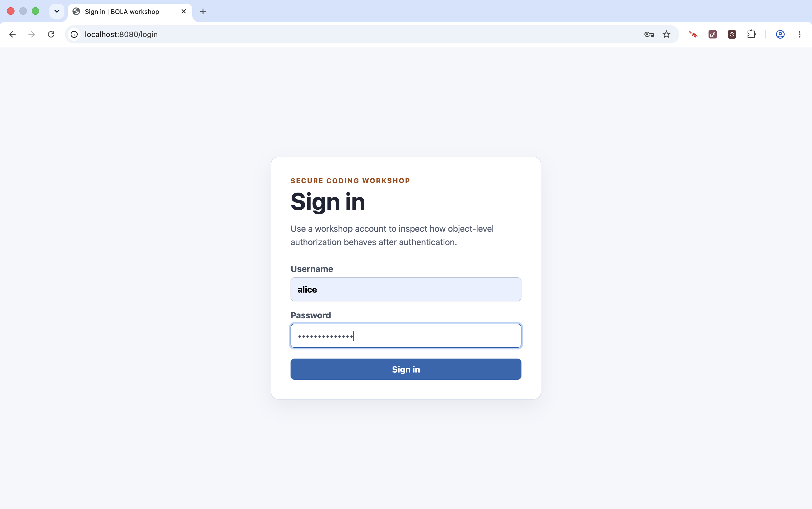
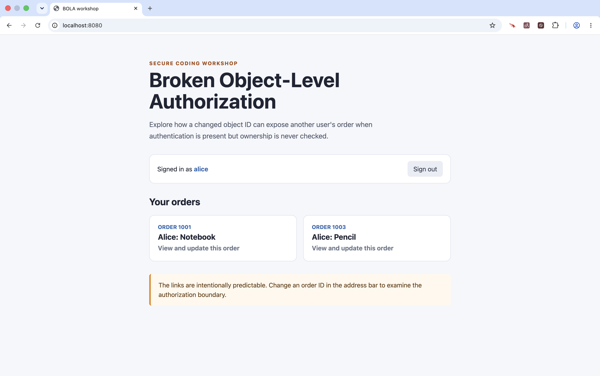
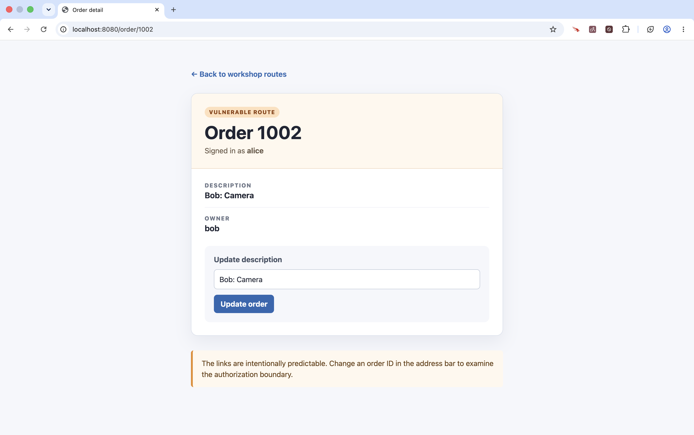
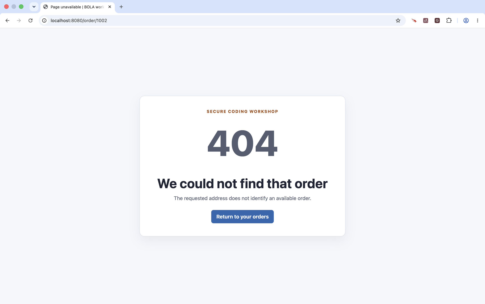

<!-- Generated by Sociable Weaver (https://github.com/albertattard/sw). Manual edits will be overwritten when regenerated. -->

# Broken Object-Level Authorization

This example shows a Broken Object-Level Authorization (BOLA) failure in a
server-rendered order application. The path segment in `/orders/{id}` is
attacker-controlled input. Alice is authenticated, but the vulnerable service
loads an order by that ID without establishing that Alice owns it. She can
therefore read and update Bob’s order.

The fixed service derives the caller from Spring Security’s context and scopes
the database lookup to both the requested order ID and the authenticated owner.
The H2 database, seeded accounts, and credentials are workshop-only fixtures;
they are not a production-ready identity or data-management design.

---

## Disclaimer

The examples provided in this repository are for **educational purposes only**
and are intended to be used **exclusively within this workshop**. While every
effort has been made to ensure accuracy and reliability, these examples are
provided **“as is”**, without any warranties, express or implied.

By using these examples, you acknowledge that you do so **at your own risk**.
The authors and contributors shall **not be held liable** for any direct,
indirect, incidental, or consequential damages resulting from the use, misuse,
or inability to use these examples.

It is the responsibility of the user to **review, test, and validate** any code
before applying it in a production or commercial environment.

### Performance Disclaimer

The performance values shown in this workshop are for reference only and should
not be treated as absolute. Results can vary depending on hardware, system
configuration, runtime environment, and other factors. Readers are encouraged to
conduct their own tests under controlled conditions to obtain accurate
measurements relevant to their specific use case.

---

## Learning objectives

By the end of this example, attendees can:

- identify an object identifier in a request path as an untrusted input;
- demonstrate how an authenticated user reads and changes another user’s order;
- trace the ownership check to the service and repository layers; and
- explain why authentication alone does not authorize access to each object.

## Prerequisites

- [Oracle Java 25 or newer](https://www.oracle.com/java/technologies/downloads/#java25)

- `curl` available on your PATH

- A modern web browser to browse the orders.

## The program to inspect

`schema.sql` establishes the order-owner relationship and `data.sql` makes the
attack deterministic: Alice owns orders `1001` and `1003`, while Bob owns order
`1002`.

- The database schema

  ```sql
  CREATE TABLE user_account (
      id       BIGINT PRIMARY KEY,
      username VARCHAR(64) NOT NULL UNIQUE,
      password VARCHAR(100) NOT NULL,
      enabled  BOOLEAN NOT NULL
  );

  CREATE TABLE customer_order (
      id          BIGINT PRIMARY KEY,
      description VARCHAR(255) NOT NULL,
      owner_id    BIGINT NOT NULL,
      CONSTRAINT customer_order_owner_fk FOREIGN KEY (owner_id) REFERENCES user_account (id)
  );
  ```

- The seeded data

  ```sql
  -- Workshop-only accounts. Both entries use BCrypt hashes, not plaintext passwords.
  INSERT INTO user_account (id, username, password, enabled) VALUES
      (1, 'alice', '$2y$10$WlVnIj63TKNmJi9T75ohwuAj1N7IW3R8Kfd9kdZ.DTk6mxSmBKEYe', TRUE),
      (2, 'bob',   '$2y$10$wjgLpVE/v2QRqeEQFYCNk.ETnYxKNN.pWTQUJ1soXzU5KexgWk2ry', TRUE);

  -- Alice's orders are 1001 and 1003. Bob's order is 1002.
  INSERT INTO customer_order (id, description, owner_id) VALUES
      (1001, 'Alice: Notebook', 1),
      (1002, 'Bob: Camera',     2),
      (1003, 'Alice: Pencil',   1);
  ```

`OrderService` loads solely by `orderId`. It deliberately ignores the
authenticated principal. A later workshop step will add the ownership check;
this checkpoint intentionally preserves the vulnerable baseline.

```java
package demo.bola;

import org.springframework.stereotype.Service;
import org.springframework.transaction.annotation.Transactional;

import java.util.List;

@Service
public class OrderService {

    private final CustomerOrderRepository repository;

    OrderService(final CustomerOrderRepository repository) {
        this.repository = repository;
    }

    public CustomerOrder findOrder(final Long orderId) {
        return repository.findById(orderId)
                .orElseThrow(OrderNotFoundException::new);
    }

    @Transactional(readOnly = true)
    public List<CustomerOrder> findOrdersFor(final String username) {
        return repository.findByOwnerUsernameOrderById(username);
    }

    @Transactional
    public void updateDescription(final Long orderId, final String description) {
        findOrder(orderId)
                .changeDescription(description);
    }
}
```

## References

- [OWASP API Security Top 10: Broken Object Level Authorization](https://owasp.org/API-Security/editions/2023/en/0x11-t10/)
- [OWASP Authorization Cheat Sheet](https://cheatsheetseries.owasp.org/cheatsheets/Authorization_Cheat_Sheet.html)
- [Spring Security reference documentation](https://docs.spring.io/spring-security/reference/)

## Guided walkthrough

Run these commands from this example directory. They use only a local,
in-memory database and do not alter system configuration.

1. Build and test the example. The tests prove that Alice’s normal home page
   shows only her order, but direct access to Bob’s ID still succeeds.

   ```shell
   ./mvnw clean package
   ```

   (*Optional*) Verify that the application was created.

   ```shell
   tree --dirsfirst --sort=name -L 1 --prune './target'
   ```

   The packaged Spring Boot JAR and the original thin JAR.

   ```
   ./target
   ├── broken-object-level-authorization-1.0.0.jar
   └── broken-object-level-authorization-1.0.0.jar.original

   1 directory, 2 files
   ```

2. Start the local application and wait for it to accept requests.

   ```shell
   java -jar 'target/broken-object-level-authorization-1.0.0.jar' > 'target/application.log' 2>&1 &
   echo $! > 'target/application.pid'

   # Wait for the application to start
   until curl -sf http://localhost:8080/login >/dev/null; do sleep 1; done
   ```

3. In a browser, sign in as `alice` with password `alice-password`:
   [localhost:8080/login](http://localhost:8080/login).

   

   The home page lists only Alice’s order.

   

   Open an order, then replace the id with `1002` in the address bar.

   

   The application displays Bob’s camera order desipre Alice is logged in.
   Change its description to: `Alice: Table` and submit the form.

   

   Alice has changed Bob’s record despite being authenticated only as herself.
   This is evidence of missing object-level authorization, not approval to use
   these credentials or the vulnerable design outside the workshop.

4. Stop the local application when finished.

   ```shell
   kill "$(cat target/application.pid)" 2>/dev/null || true
   rm -f target/application.pid
   ```

5. Reproduce the problem

   Before fixing the vulnerability, add a test that reproduces it. This test
   protects against a future change that accidentally reintroduces the issue.

   The `fixtures` directory contains an updated `OrderControllerTests` class
   with the test shown below.

   ```java
   @Test
   void aliceCannotReadOrChangeBobsOrderThroughTheFixedRoute() throws Exception {
       mockMvc.perform(get("/order/1002").with(user("alice")))
               .andExpect(status().isNotFound());

       mockMvc.perform(post("/order/1002")
                       .with(user("alice"))
                       .with(csrf())
                       .param("description", "Alice changed Bob’s order"))
               .andExpect(status().isNotFound());

       assertThat(repository.findById(1002L).orElseThrow().getDescription())
               .isEqualTo("Bob: Camera");
   }
   ```

   The test verifies that Alice cannot access Bob’s order.

   Copy the updated test class into the application.

   ```shell
   rsync --archive 'fixtures/src/test' 'src'
   ```

   Run the tests. The new test should fail because the vulnerable controller
   currently allows Alice to read Bob’s order.

   ```shell
   ./mvnw clean package
   ```

   The new test exposes the broken object-level authorization vulnerability.

   ```
   ...
   [ERROR] Failures:
   [ERROR]   OrderControllerTests.aliceCannotReadOrChangeBobsOrderThroughTheFixedRoute:74 Status expected:<404> but was:<200>
   [INFO]
   [ERROR] Tests run: 5, Failures: 1, Errors: 0, Skipped: 0
   [INFO]
   [INFO] ------------------------------------------------------------------------
   [INFO] BUILD FAILURE
   [INFO] ------------------------------------------------------------------------
   ...
   ```

6. Fix the problem

   The fix must apply the authenticated user’s identity when loading or changing
   an order. In this version, the controller obtains the authenticated username
   and passes it to the service. The service uses that username in its
   ownership-aware queries.

   The completed changes are available in `fixtures`.

   ```shell
   rsync --archive 'fixtures/src/main' 'src'
   ```

   Build the project again. The regression test should now pass.

   ```shell
   ./mvnw clean package
   ```

   All tests pass, including the regression test for Alice accessing Bob’s
   order.

   ```
   ...
   [INFO] ------------------------------------------------------------------------
   [INFO] BUILD SUCCESS
   [INFO] ------------------------------------------------------------------------
   ...
   ```

7. Start the local application and wait for it to accept requests.

   ```shell
   java -jar 'target/broken-object-level-authorization-1.0.0.jar' > 'target/application.log' 2>&1 &
   echo $! > 'target/application.pid'

   attempt=1
   until curl -sf http://localhost:8080/login >/dev/null; do
     if [ "$attempt" -ge 30 ]; then
       echo 'The application did not start within 30 seconds.' >&2
       tail -n 50 'target/application.log' >&2 || true
       exit 1
     fi
     attempt=$((attempt + 1))
     sleep 1
   done
   ```

8. Verify that the problem is fixed.

   In a browser, sign in as `alice` with password `alice-password` at
   [localhost:8080/login](http://localhost:8080/login). Open one of Alice’s
   orders, then replace the order ID in the address bar with `1002`.

   

   The application returns a not-found page and does not disclose Bob’s order.
   Alice can still view and update her own orders.

9. Stop the local application when finished.

   ```shell
   kill "$(cat target/application.pid)" 2>/dev/null || true
   rm -f target/application.pid
   ```

## Key takeaways and residual risk

- Authentication identifies Alice but does not grant access to Bob’s objects.
- A path ID is untrusted input, even if the UI normally links only to owned IDs.
- Normal navigation that lists only owned orders is useful, but it is not an
  authorization control: a caller can still alter the URL.
- A later mitigation must scope every retrieval and update by object ID and
  caller identity. Real systems may also require delegated access, tenant
  boundaries, role policies, and audit logging.
