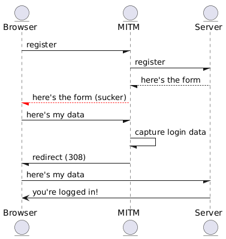
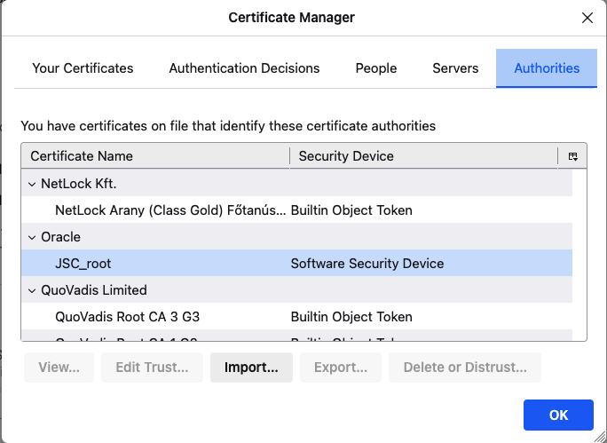

# Man In The Middle: mixed mode HTTP/HTTPS

In this example, we will demonstrate an HTTPS attack with a man in the middle. The sequence of events is
shown below.



[edit: plant uml](https://www.plantuml.com/plantuml/uml/PP2n3e8m48PtdkAC0pWGJLoCWo5k3aow6OU6dj08hRbUDRozLOl5i77tVtSVryAo87PTcw1cnJtioJmjqb2MXrCvV1-H7Zv90WBvyXF35WXhPTbdxzht0pfEGYUFGmqIfXQuGRWQwiBiUKueBvuAbYa8cNNL3Man-PF8TZr8mIBi_AMLkBCZXDRKIlyJKUVzYh1YoDQhJPJ4iwQQuRZTQ4rlNFfLrIX1wLbIe9R-fLy0)

The attacker can establish a man-in-the-middle position in a variety of ways:

1. an attack on the ARP or DNS server providing the target's IP address
2. a fake public hot spot
3. a commonly mis-typed letter in the URL

Regardless of how the initial request is hijacked, that's all that's required to get the user's login credentials.

## Prerequisites

- a recent version of Java -- this was tested with - [Java 21](https://www.oracle.com/java/technologies/javase/jdk21-archive-downloads.html)
- Maven
- [openssl](https://github.com/openssl/openssl/releases) to generate certificates (macs and linux boxes typically have this installed already)
- Access to 2 machines (e.g. a development laptop and a VM or cloud instance) on which Java is deployed and root or sudo access is available.

# Set up servers
## Establish hostnames

We're going to create 2 different hostnames for our servers, because browsers like to cache data like certificates, and will
complain if we use different certs for 2 different ports on the same "host".

On Linux or MacOS, you can update "/etc/hosts"; the same file format works for Windows and the file is located at 
\Windows\System32\drivers\etc.  You'll have to edit as root or Administrator, as this file is write protected.

Insert 2 new rows as follows, where 127.0.0.1 is your "local" machine and the other is the IP address of the 
"other" remote machine.

```
129.213.35.87   myhost
# the following has a zero, not an oh, in the fourth letter of the hostname:
127.0.0.1   myh0st
```

This will make the DNS resolver resolve "myhost" to the IP4 address 127.0.0.1, and "myh0st" to the IP4 address 129.213.35.87.

## Set up the main web server

Our main server is simple--just a login page and a "you're logged in!" page. It doesn't maintain a session state, because its
function is simply to deliver the pages we are going to attack. However, since it must support HTTPS connections, we need to 
divert into a discussion of certificates and certificate installation.

### Generate Certificates

Browsers "trust" root certificate authorities (CAs). The CA is supposed to verify the identity of any entity to which they
issue certificates. There is a chain of trust: you trust the CA (or rather, your browser does on your behalf), and then you
can trust any certificate issued by that authority. Furthermore: CAs can issue "signing certificates", which entities can then
use to extend the chain of trust. So, for example, Oracle has signing authority certificates, allowing it to sign certificates
for servers it trusts, and that authority certificate is signed by a globally-trusted certificate authority.

There's nothing special about certificate authorities, beyond the fact that they are trusted. You can issue a signing certificate
yourself (indeed, we will do so in a moment), and if you have told your browser to trust that signing certificate, then anything
it is used to sign is also trusted.

First, generate a certificate authority self-signed root certificate as follows:

```shell
# Generate a "cacert.config" file which describes the fact that the certificate to be generated is a
# "CA" cert, with a "pathlen" of 1 (indicating that only certificates signed directly by this cert
# are valid. Higher pathlens allow for longer certificate chains).

$ >cacert.config cat <<-EOF
basicConstraints = critical,CA:true,pathlen:1
keyUsage = keyCertSign
EOF

# now generate a key public/private keypair using the elliptical algorithm "prime246v1"

$ openssl ecparam -out cacert.key -name prime256v1 -genkey

# Use the private key from the keypair to generate a "certificate signing request" (CSR)
# The "distinguished name" identifies who the certificate belongs to. Fundamentally, certificates
# bind a digital signature to a "distinguished name". Note the "CN" at the end--this is the "Common name", by
# which the cert is usually known. You'll see it when you import this as a root cert. Other components of the
# distingushed name are: C->Country, ST->state, L->Locale, O->Organizatoin, OU->Organization unit or
# department, emailAddress.

$ export DNAME="/C=US/ST=OR/L=Corvallis/O=Oracle/OU=Java_Sales/emailAddress=jerry.a.andrews@oracle.com/CN=JSC_root"
$ openssl req -new -sha256 -key cacert.key -out cacert.csr -subj $DNAME

# Finally, we sign the root certificate with itself. This is the head of the chain; we now have a 
# Certificate Authority cert that we can import into the browser. The browser will trust any certificate
# signed by this root certificate

$ openssl x509 -req -sha256 -days 3650 -in cacert.csr -signkey cacert.key -out cacert.crt -extfile cacert.config

```

Now import that "root cert" into your browser so it is trusted:

On my browser (Firefox -> Preferences -> Privacy & Security -> View Certificates...):



On Chrome, navigate to [chrome://certificate-manager/](chrome://certificate-manager/), and import your root certificate there.

The "JSC_root" certificate is a cert I imported.

Now we do the same set of steps, this time using the new CA cert to sign a server certificate for our
main web server. Change to the server directory, then:

```shell
# generate an eliptic-curve server key

$ openssl ecparam -out server.key -name prime256v1 -genkey

# generate a signing request for the server key

$ export DNAME="/C=US/ST=CA/L=Redwood_Shores/O=Oracle/OU=Linux_Sales/emailAddress=albert.attard@oracle.com/CN=127.0.0.1/"
$ openssl req -new -sha256 -key server.key -out server.csr -subj $DNAME

# create the configuration file for certificate generation

>server.ext cat <<-EOF
authorityKeyIdentifier=keyid,issuer
basicConstraints=CA:FALSE
keyUsage = digitalSignature, nonRepudiation, keyEncipherment, dataEncipherment
subjectAltName = @alt_names
[alt_names]
DNS.1 = myhost # Be sure to include the domain name here because Common Name is not so commonly honoured by itself
IP.1 = 10.0.0.174 # Optionally, add an IP address (if the connection which you have planned requires it)
IP.2 = 127.0.0.1
EOF

# sign it

$ openssl x509 -req -days 3650 -CA ../cacert.crt -CAkey ../cacert.key -set_serial 001 -in server.csr -out server.crt -sha256 -extfile server.ext

# convert it to p12 format, creating a keystore

$ openssl pkcs12 -export -name server -out server.p12 -inkey server.key -in server.crt -passout pass:mitm-server-password

# display the contents of the keystore

$ keytool -list -v -keystore server.p12 <<< "mitm-server-password"
```
We will use this keystore in the server deployment.

### Build and deploy the server

From the "server" directory, inspect the `HttpServer` class. This instructs spring boot to expose 2 endpoints,
as described in `application.yaml`--one on port 80 and the other on part 443. The second is an HTTPS port
with a server certificate named "server" found in a keystore named "server.p12", with other parameters as shown.

```shell
% mvn package
```
This produces server-3.5.4.jar, a "fat" jar containing the site we are going to attack: "myhost".

Copy this file and server.p12 to a directory on your remote host. For an OCI instance, for example, this would look something like:

```shell
% scp -i ~/.ssh/ssh-key-2026-02-25.key target/server-3.5.4.jar opc@129.213.35.87:~
```

Now start the server. Log in to the remote machine and run Java as shown below. You must do this with sudo, as 
root privileges are required to bind to ports 80 and 443:

```shell
% ssh -i ~/.ssh/ssh-key-2026-02-25.key opc@129.213.35.87
% sudo jdk-25.0.2/bin/java -jar server-3.5.4.jar 
```

Verify that HTTPS is working by opening a browser on your local machine and loading the web site:

```shell
% open http://myhost
% open https://myhost
```

Log in if you like, just to see the expected workflow.

### Generate MITM certificates

```shell
# generate an eliptic-curve server key

% openssl ecparam -out mitm.key -name prime256v1 -genkey

# generate a signing request for the server key

% export DNAME="/C=US/ST=CA/L=Redwood_Shores/O=Oracle/OU=Blackhat/emailAddress=jerry@jrandrews.org/CN=myh0st/"
% openssl req -new -sha256 -key mitm.key -out mitm.csr -subj $DNAME

% >mitm.ext cat <<-EOF
authorityKeyIdentifier=keyid,issuer
basicConstraints=CA:FALSE
keyUsage = digitalSignature, nonRepudiation, keyEncipherment, dataEncipherment
subjectAltName = @alt_names
[alt_names]
DNS.1 = myh0st # Be sure to include the domain name here because Common Name is not so commonly honoured by itself
IP.1 = 10.0.0.174 # Optionally, add an IP address (if the connection which you have planned requires it)
IP.2 = 127.0.0.1
EOF

# sign it; note that we've used a new hostname and bumped the serial number. Most browsers will check to ensure that the same
# serial number and hostname isn't re-used by a CA.

% openssl x509 -req -days 3650 -CA ../cacert.crt -CAkey ../cacert.key -set_serial 002 -in mitm.csr -out mitm.crt -sha256 -extfile mitm.ext

# convert it to p12, creating a keystore

% openssl pkcs12 -export -name mitm -out mitm.p12 -inkey mitm.key -in mitm.crt -passout pass:mitm-mitm-password

# display the contents of the keystore

% keytool -list -v -keystore mitm.p12 <<< "mitm-mitm-password"
```

### Build and deploy the MITM server

Because we wanted the demo to run locally, we've use different ports for the server and MITM. For your part, that will help you
see when we're connected to the MITM and when we're talking to the server, but of course, in the Real World, the hostnames
wouldn't be the same--they'd be different, and both would run on ports 80 (HTTP) and 443 (HTTPS).

In our demo, the MITM runs on ports 81 (HTTP) and 444 (HTTPS).

```shell
% mvn clean spring-boot:run
```

Examine the source code in `WebController.java` to see what's going on.

Note that:
1. we receive inbound requests to /login, call the legitimate site to get the page content, but modify the form address.
2. we return the legitimate content with the changed form information to the end-user.
3. we receive the user's data in the subsequent POST, capture it, but the do a forward to the original web site with
    the user's data so that they are now on the regular site, logged in, and we don't need to engage with that user anymore.

# Demonstration

## Log in

Tail the logs of both servers; if you launched as shown above, you should already see the logs in the console.

Navigate to http://myh0st/login. Examine the page source and note that the iframe is delivered via HTTPS.

```shell
open https://myh0st/login
```

Fill out the form and hit "submit". Examine the logs of the MITM and note that your username and password were captured.

Note that the success page on the browser indiciates that (a) you're now on the correct web site, and (b) it knows you've
logged in.

Examine the MITM log. Note that we have logged the user's login information, including the password.

Exampine the server log. As you can see, the POST (probably the last thing logged) containst the following headers:

```
...WebController   : ---- logging headers for login page request
...WebController   : host=myhost
...WebController   : connection=keep-alive
...WebController   : content-length=43
...WebController   : cache-control=max-age=0
...WebController   : origin=null
...WebController   : content-type=application/x-www-form-urlencoded
...WebController   : upgrade-insecure-requests=1
...WebController   : user-agent=Mozilla/5.0 (Macintosh; Intel Mac OS X 10_15_7) AppleWebKit/537.36 (KHTML, like Gecko) Chrome/145.0.0.0 Safari/537.36
...WebController   : accept=text/html,application/xhtml+xml,application/xml;q=0.9,image/avif,image/webp,image/apng,*/*;q=0.8,application/signed-exchange;v=b3;q=0.7
...WebController   : sec-fetch-site=cross-site
...WebController   : sec-fetch-mode=navigate
...WebController   : sec-fetch-user=?1
...WebController   : sec-fetch-dest=document
...WebController   : sec-ch-ua="Not:A-Brand";v="99", "Google Chrome";v="145", "Chromium";v="145"
...WebController   : sec-ch-ua-mobile=?0
...WebController   : sec-ch-ua-platform="macOS"
...WebController   : referer=https://myh0st/
...WebController   : accept-encoding=gzip, deflate, br, zstd
...WebController   : accept-language=en-US,en;q=0.9
...WebController   : ----

```
One indication that something isn't right are those sec-fetch-site and referrer headers; certainly not the expected values.

Note that at this point, the MITM has already capture the user's credentials, so blocking the user at this point is probably important, but also letting them know they've been compromised is also important.