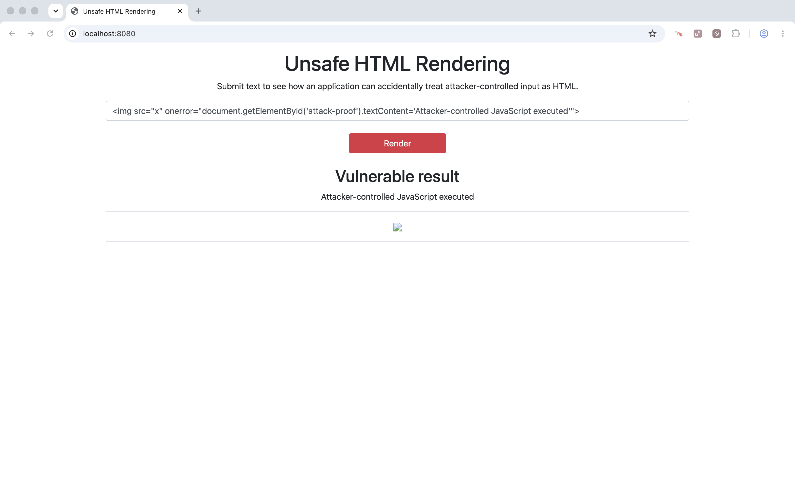

<!-- Generated by Sociable Weaver (https://github.com/albertattard/sw). Manual edits will be overwritten when regenerated. -->

# Reflected XSS and HTML Output Encoding

This example accepts text submitted through a web form. That value crosses a
trust boundary: it is controlled by the browser user and must not be treated as
trusted HTML. The vulnerable template renders it with Thymeleaf `th:utext`, so
the browser parses attacker-supplied markup and can execute an event handler.

The fixed variant encodes the value for an HTML element with OWASP Java Encoder
before rendering it. The browser then displays the supplied markup as text. This
example is deliberately limited to HTML element content; JavaScript, attribute,
URL, CSS, and other output contexts require their own controls.

---

## Disclaimer

The examples provided in this repository are for **educational purposes only**
and are intended to be used **exclusively within this workshop**. While every
effort has been made to ensure accuracy and reliability, these examples are
provided **“as is”**, without any warranties, express or implied.

By using these examples, you acknowledge that you do so **at your own risk**.
The authors and contributors shall **not be held liable** for any direct,
indirect, incidental, or consequential damages resulting from the use, misuse,
or inability to use these examples.

It is the responsibility of the user to **review, test, and validate** any code
before applying it in a production or commercial environment.

### Performance Disclaimer

The performance values shown in this workshop are for reference only and should
not be treated as absolute. Results can vary depending on hardware, system
configuration, runtime environment, and other factors. Readers are encouraged to
conduct their own tests under controlled conditions to obtain accurate
measurements relevant to their specific use case.

---

## Learning objectives

By the end of this example, attendees can:

- identify form input as an untrusted value at the server-rendered HTML
  boundary;
- demonstrate why rendering untrusted input as HTML enables injected browser
  code;
- add and verify an HTML output-encoding regression test; and
- explain why encoding must match the output context and does not authorize rich
  HTML.

## Prerequisites

- [Oracle Java 25 or newer](https://www.oracle.com/java/technologies/downloads/#java25)

- `rsync` available on your PATH to copy the workshop fixture into the local
   source tree.

- A modern web browser is required for the interactive proof.

## The program to inspect

`UserInput` stores the submitted value.

```java
package demo.ui;

public record UserInput(String message) {}
```

The baseline exposes the value directly. Its template uses `th:utext`, the
Thymeleaf instruction for unescaped HTML output. That is the unsafe behaviour:
the browser receives the submitted string as markup, not data.

```html
<section aria-labelledby="result-heading">
    <h2 id="result-heading">Vulnerable result</h2>
    <p id="attack-proof" role="status">No attacker-controlled JavaScript has executed.</p>
    <div class="border p-3" th:utext="${UserInput.message}">Submitted text appears here.</div>
</section>
```

The fixed fixture adds `getHtmlEncodedString()`, which calls
`Encode.forHtml(string)`.

```java
package demo.ui;

import org.owasp.encoder.Encode;

public record UserInput(String message) {
    public String getHtmlEncodedMessage() {
        return Encode.forHtml(message);
    }
}
```

It keeps `th:utext` only to make the contrast explicit: the already HTML-encoded
value is emitted without a second template escape and is parsed by the browser
as text rather than as an element. In ordinary Thymeleaf templates, `th:text` is
often the clearer safe default for plain text.

```html
<section aria-labelledby="result-heading">
    <h2 id="result-heading">Fixed result</h2>
    <p id="attack-proof" role="status">No attacker-controlled JavaScript has executed.</p>
    <div class="border p-3" th:utext="${UserInput.htmlEncodedMessage}">Submitted text appears here.</div>
</section>
```

The fixture test expresses the required property: a submitted `` must be
present only as escaped text in the HTTP response, never as an HTML element. The
test cannot execute browser JavaScript; the browser step below provides that
visual evidence.

```java
@Test
void submittedHtmlIsRenderedAsTextInsteadOfAnElement() throws Exception {
    final String attackPayload = """
            """;
    mockMvc.perform(post("/").param("message", attackPayload))
            .andExpect(status().isOk())
            .andExpect(content().string(containsString("&lt;img")))
            .andExpect(content().string(not(containsString(" 'target/application.log' 2>&1 &
   echo $! > 'target/application.pid'

   # Wait for the application to start
   until curl --silent --fail http://localhost:8080/ >/dev/null; do sleep 1; done
   ```

3. Open [http://localhost:8080](http://localhost:8080). Submit the following
   harmless, page-local payload:

   ```html
   
   ```

   The invalid local image triggers `onerror`. The status text changes to
   **Attacker-controlled JavaScript executed**, proving that untrusted data was
   interpreted as code by the browser.

   

   In a real application, code at this origin could read page data, perform
   actions as the current user, or send data to an attacker-controlled
   destination. The local payload here changes only a status message and stores
   no data.

4. Stop the vulnerable server before replacing its source files.

   ```shell
   kill "$(cat target/application.pid)" 2>/dev/null || true
   ```

5. Add the regression test before applying the fix.

   The test is intentionally expected to fail: the baseline emits the raw
   `` element instead of escaped text. This turns the required security
   behaviour into an executable check against future regressions.

   ```shell
   rsync --archive 'fixtures/src/test' 'src'
   ```

   Run the tests. The new test should fail because the HTML input is not
   encoded.

   ```shell
   ./mvnw clean package
   ```

   The regression test fails because the vulnerable response contains raw
   attacker HTML.

   ```
   ...
   [ERROR] Failures:
   [ERROR]   UiControllerTest.submittedHtmlIsRenderedAsTextInsteadOfAnElement:37 Response content
   Expected: not a string containing "\n<html lang=\"en\">\n<head>\n    <meta charset=\"UTF-8\">\n    <title>Unsafe HTML Rendering</title>\n    <link rel=\"stylesheet\" href=\"css/bootstrap.min.css\">\n</head>\n<body>\n<div class=\"container my-2\" align=\"center\">\n    <h1>Unsafe HTML Rendering</h1>\n    <p>Submit text to see how an application can accidentally treat attacker-controlled input as HTML.</p>\n    <form action=\"/\" method=\"POST\">\n        <input type=\"text\" placeholder=\"enter term to encode...\" class=\"form-control mb-4\" id=\"message\" name=\"message\" value=\"&lt;img src=&quot;x&quot; onerror=&quot;document.getElementById(&#39;attack-proof&#39;).textContent=&#39;Attacker-controlled JavaScript executed&#39;&quot;&gt;\">\n        <button type=\"submit\" class=\"btn btn-danger col-2\">Render</button>\n    </form>\n    <br/>\n    <section aria-labelledby=\"result-heading\">\n        <h2 id=\"result-heading\">Vulnerable result</h2>\n        <p id=\"attack-proof\" role=\"status\">No attacker-controlled JavaScript has executed.</p>\n        <div class=\"border p-3\"></div>\n    </section>\n</div>\n</body>\n</html>\n"
   [INFO]
   [ERROR] Tests run: 2, Failures: 1, Errors: 0, Skipped: 0
   [INFO]
   [INFO] ------------------------------------------------------------------------
   [INFO] BUILD FAILURE
   [INFO] ------------------------------------------------------------------------
   ...
   ```

6. Apply the completed fixed variant.

   It HTML-encodes the submitted value before rendering it. This is correct only
   for HTML element content; do not reuse it for an attribute, URL, JavaScript,
   CSS, or a rich-HTML feature without reviewing that specific sink and its
   required control.

   ```shell
   rsync --archive 'fixtures/src/main' 'src'
   ```

   Build the project again. The regression test should now pass.

   ```shell
   ./mvnw clean package
   ```

   The regression test passes after the HTML encoder is applied.

   ```
   ...
   [INFO] ------------------------------------------------------------------------
   [INFO] BUILD SUCCESS
   [INFO] ------------------------------------------------------------------------
   ...
   ```

7. Start the fixed application and submit the same payload.

   It is displayed as literal text, the status message does not change, and no
   image element is created.

   ```shell
   java -jar 'target/reflected-xss-1.0.0.jar' > 'target/application.log' 2>&1 &
   echo $! > 'target/application.pid'

   # Wait for the application to start
   until curl --silent --fail http://localhost:8080/ >/dev/null; do sleep 1; done
   ```

8. Open [http://localhost:8080](http://localhost:8080). And try the same attack:

   ```html
   
   ```

   Note how this is safely displayed and the anglebrackets encoded making the
   text safe to embed as part of the page.

9. Stop the application when ready.

   ```shell
   kill "$(cat target/application.pid)" 2>/dev/null || true
   ```

## Key takeaways and residual risk

- Rendering an untrusted string as HTML lets an attacker supply browser markup
  and event handlers.
- HTML output encoding changes the payload from browser-interpreted markup into
  displayed text.
- The regression test verifies the response encoding; the browser interaction
  demonstrates the runtime effect.
- If a feature genuinely needs user-authored HTML, make an explicit product
  decision and use a reviewed, strict allowlist sanitizer plus defence-in-depth
  controls such as CSP. Encoding alone intentionally removes all markup rather
  than allowing selected tags.
