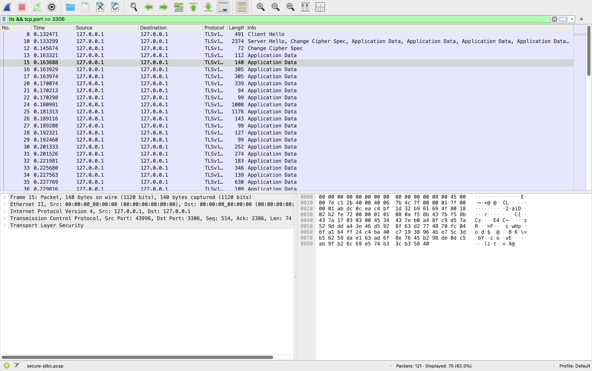

<!-- Generated by Sociable Weaver (https://github.com/albertattard/sw). Manual edits will be overwritten when regenerated. -->

# Observe and secure a JDBC connection

This exercise makes the network trust boundary observable. A deliberately
insecure, loopback-only MySQL instance accepts a plaintext JDBC connection
containing harmless sensitive-payload markers. You capture that traffic, then
repeat the same request over TLS and verify that the marker is no longer
readable on the wire.

The marker is **not an actual password**. Modern MySQL authentication may
protect a password even without TLS, so claiming that every password is sent in
plaintext would be inaccurate. The marker represents sensitive application data:
queries and results that TLS must protect.

---

## Disclaimer

The examples provided in this repository are for **educational purposes only**
and are intended to be used **exclusively within this workshop**. While every
effort has been made to ensure accuracy and reliability, these examples are
provided **“as is”**, without any warranties, express or implied.

By using these examples, you acknowledge that you do so **at your own risk**.
The authors and contributors shall **not be held liable** for any direct,
indirect, incidental, or consequential damages resulting from the use, misuse,
or inability to use these examples.

It is the responsibility of the user to **review, test, and validate** any code
before applying it in a production or commercial environment.

### Performance Disclaimer

The performance values shown in this workshop are for reference only and should
not be treated as absolute. Results can vary depending on hardware, system
configuration, runtime environment, and other factors. Readers are encouraged to
conduct their own tests under controlled conditions to obtain accurate
measurements relevant to their specific use case.

---

## Learning objectives

By the end of this example, attendees can:

- capture a deliberately plaintext JDBC session;
- identify a sensitive marker in the captured MySQL traffic;
- verify TLS session evidence; and
- explain why encryption, CA trust, and server identity checks address different
  risks.

## Prerequisites

- [Oracle Java 25 or newer](https://www.oracle.com/java/technologies/downloads/#java25)

- `tcpdump` available on your PATH

- `.local/secret.properties`, containing `root`, `user`, and `keys` values.

  ```properties
  root=xxxxxx
  user=xxxxxx
  keys=xxxxxx
  ```

All commands run from this example directory. MySQL is bound to `127.0.0.1` and
is not reachable from other machines.

## The program to inspect

The application always sends two harmless sensitive-payload markers before
reading seeded data. In `DISABLED` mode they are readable by a network observer.
In secure modes the same markers are protected by TLS. The program never prints
its complete JDBC URL because it can contain a truststore password.

```java
package demo;

import java.io.FileReader;
import java.io.IOException;
import java.sql.Connection;
import java.sql.DriverManager;
import java.sql.ResultSet;
import java.sql.SQLException;
import java.sql.Statement;
import java.util.Properties;
import java.util.Set;

public final class Main {

    private static final Properties secrets = new Properties();

    static {
        try {
            secrets.load(new FileReader(".local/secret.properties"));
        } catch (final IOException e) {
            e.printStackTrace();
        }
    }

    private static final String DB_USER = "demo";
    private static final String DB_PASS;
    private static final String JDBC_URL_STUB = "jdbc:mysql://localhost:3306/demo?sslMode=";
    private static final String CONNECT_TIMEOUT = "&connectTimeout=5000";

    private static final Set<String> SSL_MODES = Set.of("DISABLED", "REQUIRED", "VERIFY_CA", "VERIFY_IDENTITY");
    private static final String TRUST_STORE_URL = "&trustCertificateKeyStoreUrl=file:target/truststore.pkcs12";
    private static final String TRUST_STORE_PASS;

    static {
        DB_PASS = secrets.getProperty("user");
        TRUST_STORE_PASS = "&trustCertificateKeyStorePassword=" + secrets.getProperty("keys");
    }

    public static void main(String[] args) {
        if (args.length < 1 || args.length > 2 || !SSL_MODES.contains(args[0])) {
            System.err.println("Usage: Main <DISABLED|REQUIRED|VERIFY_CA|VERIFY_IDENTITY> [truststore]");
            System.exit(2);
        }

        String sslMode = args[0];
        boolean useTrustStore = args.length == 2 && "truststore".equals(args[1]);
        if (args.length == 2 && !useTrustStore) {
            System.err.println("The optional second argument must be truststore.");
            System.exit(2);
        }
        if (useTrustStore && !("VERIFY_CA".equals(sslMode) || "VERIFY_IDENTITY".equals(sslMode))) {
            System.err.println("A truststore applies only to VERIFY_CA or VERIFY_IDENTITY.");
            System.exit(2);
        }

        String insecureProbeOption = "DISABLED".equals(sslMode) ? "&allowPublicKeyRetrieval=true" : "";
        String url = JDBC_URL_STUB + sslMode + CONNECT_TIMEOUT + insecureProbeOption
                + (useTrustStore ? TRUST_STORE_URL + TRUST_STORE_PASS : "");

        System.out.printf("\nConnecting with sslMode=%s; truststore=%s%n%n", sslMode, useTrustStore ? "configured" : "not configured");
        try (Connection connection = DriverManager.getConnection(url, DB_USER, DB_PASS); Statement setupStatement = connection.createStatement(); Statement tlsStatement = connection.createStatement(); Statement queryStatement = connection.createStatement()) {

            printSensitivePayload(queryStatement);
            if (!"DISABLED".equals(sslMode)) {
                printTlsStatus(tlsStatement);
            }

            try (ResultSet resultSet = queryStatement.executeQuery("SELECT * FROM catalogue_item")) {
                while (resultSet.next()) {
                    int id = resultSet.getInt("id");
                    String name = resultSet.getString("caption");
                    System.out.println("ID: " + id + ", Name: " + name);
                }
            }

        } catch (SQLException e) {
            System.err.println("SQLException: " + e.getMessage());
            System.err.println("SQLState: " + e.getSQLState());
            System.err.println("VendorError: " + e.getErrorCode());
            e.printStackTrace(System.err);
            System.exit(1);
        }

        System.out.println("\n~~~ Done! ~~~");
    }

    private static void printTlsStatus(Statement statement) throws SQLException {
        System.out.println("\n~~~ TLS session evidence ~~~");
        try (ResultSet resultSet = statement.executeQuery("SHOW SESSION STATUS WHERE Variable_name IN ('Ssl_cipher', 'Ssl_version')")) {
            while (resultSet.next()) {
                System.out.println(resultSet.getString("Variable_name") + ": " + resultSet.getString("Value"));
            }
        }
    }

    private static void printSensitivePayload(Statement statement) throws SQLException {
        System.out.println("\n~~~ sensitive payload sent to MySQL ~~~");
        try (ResultSet resultSet = statement.executeQuery("""
                SELECT 'workshop-password-marker=not-a-real-password' AS password_marker,
                       'customer-note=confidential-workshop-data' AS customer_note
                """)) {
            resultSet.next();
            System.out.println(resultSet.getString("password_marker"));
            System.out.println(resultSet.getString("customer_note"));
        }
    }
}
```

## Guided walkthrough

1. Build and test the example.

   ```shell
   ./mvnw clean package
   ```

   (*Optional*) Verify that the application was created.

   ```shell
   tree --dirsfirst --sort=name -L 1 --prune './target/libs'
   ```

   The application JAR together with the database dependencies.

   ```
   ./target/libs
   ├── mysql-connector-j-26.7.0.jar
   ├── protobuf-java-4.31.1.jar
   └── secure-jdbc-mysql-1.0.0.jar

   1 directory, 3 files
   ```

2. Create the temporary certificates used in this workshop’s TLS trust
   relationship.

   TLS needs more than encryption: the Java application also needs evidence that
   the peer claiming to be MySQL is the intended server. We therefore create a
   private, **workshop-only** Certificate Authority (CA), then use that CA to
   sign a certificate for the MySQL server. MySQL receives the signed server
   certificate and its private key. Java later imports only the CA certificate
   into a local truststore. During the TLS handshake, Java can verify that
   MySQL’s certificate was signed by that trusted CA without possessing the CA
   private key.

   The server certificate declares `localhost` (and `127.0.0.1`) in its Subject
   Alternative Name (SAN). This is what makes `VERIFY_IDENTITY` meaningful: it
   verifies both the issuing CA and that the certificate is valid for the name
   in the JDBC URL. A certificate signed by the correct CA but issued for a
   different host must not be accepted.

   The CA, private keys, and seven-day certificates are disposable workshop
   material. They demonstrate the trust relationship; they are not a production
   certificate-management model.

   ```shell
   # Remove certificates from an earlier workshop run.
   # 'target/' is disposable output.
   certs_dir='target/mysql-certs'
   rm -rf   "${certs_dir}"
   mkdir -p "${certs_dir}"

   # Creates a temporary Certificate Authority (CA): a private key plus a
   # self-signed CA certificate.
   openssl req -x509 -newkey rsa:2048 -nodes -days 7 \
     -subj '/CN=Secure JDBC Workshop CA' \
     -keyout "${certs_dir}/ca-key.pem" \
     -out "${certs_dir}/ca.pem"

   # Creates MySQL’s private key and a certificate-signing request (CSR).
   openssl req -newkey rsa:2048 -nodes \
     -keyout "${certs_dir}/server-key.pem" \
     -out "${certs_dir}/server-request.pem" \
     -config 'containers/mysql/server-cert.cnf'

   # Signs the MySQL certificate request with the workshop CA, creating the
   # certificate MySQL will present to JDBC clients.
   openssl x509 -req -days 7 \
     -in "${certs_dir}/server-request.pem" \
     -CA "${certs_dir}/ca.pem" \
     -CAkey "${certs_dir}/ca-key.pem" \
     -CAcreateserial \
     -out "${certs_dir}/server-cert.pem" \
     -extfile 'containers/mysql/server-cert.cnf' \
     -extensions server_extensions

   # Required only because this disposable workshop key is bind-mounted into a
   # container process running as a different Unix user. Never do this for a
   # production private key.
   chmod 644 "${certs_dir}/server-key.pem"
   ```

3. Start the deliberately unsafe database.

   It is loopback-only, meaning Docker publishes MySQL on `127.0.0.1:3306` so
   that only processes running on this same machine can connect to it through
   `localhost:3306;` other machines on the network cannot reach this workshop
   database.

   The server policy, `--require-secure-transport=OFF`, temporarily permits
   non-TLS MySQL connections so the workshop can capture readable application
   traffic. This is the deliberately vulnerable baseline, not a deployment
   pattern.

   ```shell
   # Read the passwords from the 'secret.properties' file
   workshop_root_password="$(sed -n 's/^root=//p' .local/secret.properties)"
   workshop_database_password="$(sed -n 's/^user=//p' .local/secret.properties)"

   # Identify the right image tag
   mysql_image='container-registry.oracle.com/mysql/community-server:9.7.3'
   if [ "$(uname -m)" = arm64 ]; then mysql_image="${mysql_image}-aarch64"; fi

   # Start the database
   docker run \
     --rm \
     --detach \
     --name mysql-plaintext \
     --publish 127.0.0.1:3306:3306 \
     --env MYSQL_ROOT_PASSWORD="${workshop_root_password}" \
     --env MYSQL_DATABASE=demo --env MYSQL_USER=demo \
     --env MYSQL_PASSWORD="${workshop_database_password}" \
     --volume "$(pwd)/containers/mysql/my.cnf:/etc/my.cnf:ro,Z" \
     --volume "$(pwd)/target/mysql-certs/ca.pem:/etc/mysql/ca.pem:ro,Z" \
     --volume "$(pwd)/target/mysql-certs/server-cert.pem:/etc/mysql/server-cert.pem:ro,Z" \
     --volume "$(pwd)/target/mysql-certs/server-key.pem:/etc/mysql/server-key.pem:ro,Z" \
     --health-cmd='mysqladmin ping --silent' "${mysql_image}" \
     --ssl-ca=/etc/mysql/ca.pem \
     --ssl-cert=/etc/mysql/server-cert.pem \
     --ssl-key=/etc/mysql/server-key.pem \
     --auto-generate-certs=OFF \
     --require-secure-transport=OFF

   # Wait for the database to become ready
   until [ "$(docker inspect --format '{{.State.Health.Status}}' mysql-plaintext)" = healthy ]; do sleep 1; done
   ```

   Bootstrap the database using the `containers/mysql/init.sql` script

   ```shell
   # Read the user password from the 'secret.properties' file
   workshop_database_password="$(sed -n 's/^user=//p' .local/secret.properties)"

   # Bootstrap the database
   docker exec \
     --env MYSQL_PWD="${workshop_database_password}" \
     --interactive mysql-plaintext \
       mysql --protocol=SOCKET --socket=/var/lib/mysql/mysql.sock --user=demo demo < 'containers/mysql/init.sql'
   ```

   This bootstrap command connects to MySQL through its local Unix-domain
   socket, `/var/lib/mysql/mysql.sock`, rather than through TCP. The client and
   database process are inside the same container, so this setup step does not
   cross the network trust boundary or create traffic for the packet-capture
   demonstration. It also avoids requiring an insecure TCP
   password-authentication fallback while the deliberately vulnerable database
   is being initialized.

4. Start capture before running the next command.

   On macOS use `lo0`; On Linux use `lo`.

   ```shell
   # Obtains authentication before backgrounding; otherwise a password prompt
   # may fail invisibly in the background.
   sudo -v

   sudo tcpdump -U -i lo -nn -s 0 \
     -w 'target/plaintext-jdbc.pcap' 'tcp port 3306' \
     > 'target/tcpdump.log' 2>&1 &
   echo "$!" > './target/tcpdump.pid'
   ```

   Run the Java demonstration application with TLS deliberately disabled.

   It connects to the local MySQL database over TCP, sends the harmless
   sensitive-payload markers, and reads the seeded data. Because TLS is
   disabled, a local packet capture can observe the application traffic.

   ```shell
   java --class-path 'target/libs/*' demo.Main DISABLED
   ```

   Plaintext application payload

   ```
   Connecting with sslMode=DISABLED; truststore=not configured


   ~~~ sensitive payload sent to MySQL ~~~
   workshop-password-marker=not-a-real-password
   customer-note=confidential-workshop-data
   ID: 1, Name: Leather Sofa
   ID: 2, Name: Wooden Table
   ID: 3, Name: Plastic Chair
   ID: 4, Name: Mug
   ID: 5, Name: LED TV

   ~~~ Done! ~~~
   ```

   Wait for `tcpdump` to capture the data and write it to file.

   ```shell
   until tshark -r 'target/plaintext-jdbc.pcap' \
     -Y 'frame contains "workshop-password-marker"' \
     -T fields -e frame.number 2>/dev/null | grep -q .; do
     sleep 1
   done
   ```

   Open `target/plaintext-jdbc.pcap` in Wireshark and use the display filter
   `mysql` or `tcp.port == 3306`. Find
   `workshop-password-marker=not-a-real-password` and
   `customer-note=confidential-workshop-data`. A privileged local capture is the
   workshop’s controlled attacker position.

   ```shell
   tshark -r 'target/plaintext-jdbc.pcap' \
     -Y 'frame contains "workshop-password-marker"' \
     -V
   ```

   Plaintext application payload

   ```
   ...
   MySQL Protocol
       Packet Length: 144
       Packet Number: 0
       Request Command Query
           Command: Query (3)
           Query Attributes
               Count: 0
           Statement: SELECT 'workshop-password-marker=not-a-real-password' AS password_marker,\n       'customer-note=confidential-workshop-data' AS customer_note\n
   ...
   ```

   As you can see the query appears in plaintext.

5. Stop the vulnerable database.

   Its writable state disappears because it is a disposable `--rm` container.

   ```shell
   docker logs mysql-plaintext > target/mysql-plaintext.log 2>&1
   docker stop mysql-plaintext
   ```

   Stop `tcpdump` too. We will run this again and capture the output into a
   different file, so that not to polute the data.

   ```shell
   sudo kill "$(cat './target/tcpdump.pid')" 2>/dev/null || true
   wait "$(cat './target/tcpdump.pid')" 2>/dev/null || true
   ```

6. Start the secure database using the same database, seed data, and certificate
   files. Explicit TLS options disable MySQL’s certificate-generation fallback:
   if the mounted certificate or key cannot be used, startup must fail.

   ```shell
   # Read the passwords from the 'secret.properties' file
   workshop_root_password="$(sed -n 's/^root=//p' .local/secret.properties)"
   workshop_database_password="$(sed -n 's/^user=//p' .local/secret.properties)"

   # Identify the right image tag
   mysql_image='container-registry.oracle.com/mysql/community-server:9.7.3'
   if [ "$(uname -m)" = arm64 ]; then mysql_image="${mysql_image}-aarch64"; fi

   # Start the database
   docker run \
     --rm \
     --detach \
     --name mysql-secure \
     --publish 127.0.0.1:3306:3306 \
     --env MYSQL_ROOT_PASSWORD="${workshop_root_password}" \
     --env MYSQL_DATABASE=demo --env MYSQL_USER=demo \
     --env MYSQL_PASSWORD="${workshop_database_password}" \
     --volume "$(pwd)/containers/mysql/my.cnf:/etc/my.cnf:ro,Z" \
     --volume "$(pwd)/target/mysql-certs/ca.pem:/etc/mysql/ca.pem:ro,Z" \
     --volume "$(pwd)/target/mysql-certs/server-cert.pem:/etc/mysql/server-cert.pem:ro,Z" \
     --volume "$(pwd)/target/mysql-certs/server-key.pem:/etc/mysql/server-key.pem:ro,Z" \
     --health-cmd='mysqladmin ping --silent' "${mysql_image}" \
     --ssl-ca=/etc/mysql/ca.pem \
     --ssl-cert=/etc/mysql/server-cert.pem \
     --ssl-key=/etc/mysql/server-key.pem \
     --auto-generate-certs=OFF \
     --require-secure-transport=ON

   # Wait for the database to become ready
   until [ "$(docker inspect --format '{{.State.Health.Status}}' mysql-secure)" = healthy ]; do sleep 1; done
   ```

   Verify that the server actually presents a certificate signed by the workshop
   CA. This catches a Linux bind-mount or private-key permission problem before
   the Java CA-verification step.

   ```shell
   # Connect directly to MySQL using TLS and verify that it presents a certificate
   # signed by the workshop CA before testing the Java client’s trust configuration.
   if ! openssl s_client -connect 127.0.0.1:3306 -starttls mysql \
   -CAfile 'target/mysql-certs/ca.pem' \
   -verify_return_error \
   -showcerts </dev/null \
   > 'target/presented-server-chain.pem' \
   2> 'target/presented-server-chain.log'; then
     cat 'target/presented-server-chain.log' >&2
     exit 1
   fi

   # Extract the first certificate MySQL presented so OpenSSL can verify it against
   # the workshop CA in the next command.
   sed -n '/-----BEGIN CERTIFICATE-----/,/-----END CERTIFICATE-----/p' \
     'target/presented-server-chain.pem' > 'target/presented-server-cert.pem'
   test -s 'target/presented-server-cert.pem'

   # Verify that MySQL’s presented server certificate chains back to the workshop CA.
   openssl verify \
     -CAfile 'target/mysql-certs/ca.pem' \
     'target/presented-server-cert.pem'
   ```

   Server certificate verification evidence

   ```
   target/presented-server-cert.pem: OK
   ```

   Bootstrap the database

   ```shell
   # Read the user password from the 'secret.properties' file
   workshop_database_password="$(sed -n 's/^user=//p' .local/secret.properties)"

   # Bootstrap the database
   docker exec \
     --env MYSQL_PWD="${workshop_database_password}" \
     --interactive mysql-secure \
     mysql --protocol=TCP --host=127.0.0.1 --user=demo --ssl-mode=REQUIRED demo < containers/mysql/init.sql
   ```

   This bootstrap command connects to MySQL over TCP at `127.0.0.1:3306` inside
   the container and specifies `--ssl-mode=REQUIRED`. Unlike a Unix-domain
   socket, this exercises MySQL’s network listener and requires a TLS session
   before password authentication or SQL execution can proceed. It provides an
   early check that the secure database accepts TLS-protected TCP connections
   before the Java application performs its CA and server-identity validation.

   Import the database’s certificate to Java’s trust store. This allows the
   communication to be encrypted making eavesdropping difficult.

   ```shell
   # Read the keys password from the 'secret.properties' file
   workshop_truststore_password="$(sed -n 's/^keys=//p' .local/secret.properties)"

   # Import the workshop CA certificate into a local PKCS#12 Java truststore so
   # Connector/J can verify that MySQL’s server certificate was issued by this CA.
   keytool -importcert \
     -noprompt \
     -alias 'mysqlcacert' \
     -file 'target/mysql-certs/ca.pem' \
     -keystore 'target/truststore.pkcs12' \
     -storetype PKCS12 \
     -storepass "${workshop_truststore_password}"
   ```

7. Capture again with the same Wireshark or `tcpdump` command, then run the
   secure connection.

   Wireshark still shows TCP packets, but it cannot decode the sensitive markers
   because the MySQL payload is TLS-encrypted. Start capture before running the
   next command.

   On macOS use `lo0`; On Linux use `lo`.

   ```shell
   # Obtains authentication before backgrounding; otherwise a password prompt
   # may fail invisibly in the background.
   sudo -v

   sudo tcpdump -U -i lo -nn -s 0 \
     -w 'target/secure-jdbc.pcap' 'tcp port 3306' \
     > 'target/tcpdump.log' 2>&1 &
   echo "$!" > './target/tcpdump.pid'
   ```

   Run the Java demonstration application with Connector/J configured to require
   TLS when connecting to MySQL. Confirm that the application establishes an
   encrypted TCP session before it sends the harmless sensitive-payload markers
   or reads the seeded data. Note that `REQUIRED` proves encryption for this
   session, but it does not verify that the certificate belongs to the intended
   MySQL server; CA and identity verification follow in later steps.

   ```shell
   java --class-path 'target/libs/*' demo.Main REQUIRED
   ```

   TLS session evidence

   ```
   Connecting with sslMode=REQUIRED; truststore=not configured


   ~~~ sensitive payload sent to MySQL ~~~
   workshop-password-marker=not-a-real-password
   customer-note=confidential-workshop-data

   ~~~ TLS session evidence ~~~
   Ssl_cipher: TLS_AES_128_GCM_SHA256
   Ssl_version: TLSv1.3
   ID: 1, Name: Leather Sofa
   ID: 2, Name: Wooden Table
   ID: 3, Name: Plastic Chair
   ID: 4, Name: Mug
   ID: 5, Name: LED TV

   ~~~ Done! ~~~
   ```

   Wait for `tcpdump` to capture the data and write it to file.

   ```shell
   until tshark -r 'target/secure-jdbc.pcap' \
     -Y 'tls' \
     -T fields -e frame.number 2>/dev/null | grep -q .; do
     sleep 1
   done
   ```

   Open `target/secure-jdbc.pcap` in Wireshark and use the display filter
   `tls && tcp.port == 3306`. You should see the TLS handshake followed by TLS
   application-data records, rather than a readable MySQL `Query` statement.

   

   The highlighted packet shows the Java client sending TLS application data to
   MySQL on port 3306. Its byte pane contains opaque encrypted bytes rather than
   the readable SQL statement and sensitive markers visible in the plaintext
   capture. A passive observer without the TLS session keys can still see
   metadata such as addresses, ports, timing, and packet sizes, but cannot read the
   protected application payload.

8. Verify the certificate chain and expected server identity.

   These checks address the active-attacker case: encryption alone does not
   establish that the TLS peer is the intended MySQL server.

   ```shell
   java --class-path 'target/libs/*' demo.Main VERIFY_CA truststore
   ```

   CA verification evidence

   ```
   Connecting with sslMode=VERIFY_CA; truststore=configured


   ~~~ sensitive payload sent to MySQL ~~~
   workshop-password-marker=not-a-real-password
   customer-note=confidential-workshop-data

   ~~~ TLS session evidence ~~~
   Ssl_cipher: TLS_AES_128_GCM_SHA256
   Ssl_version: TLSv1.3
   ID: 1, Name: Leather Sofa
   ID: 2, Name: Wooden Table
   ID: 3, Name: Plastic Chair
   ID: 4, Name: Mug
   ID: 5, Name: LED TV

   ~~~ Done! ~~~
   ```

   ```shell
   java --class-path 'target/libs/*' demo.Main VERIFY_IDENTITY truststore
   ```

   Identity verification evidence

   ```
   Connecting with sslMode=VERIFY_IDENTITY; truststore=configured


   ~~~ sensitive payload sent to MySQL ~~~
   workshop-password-marker=not-a-real-password
   customer-note=confidential-workshop-data

   ~~~ TLS session evidence ~~~
   Ssl_cipher: TLS_AES_128_GCM_SHA256
   Ssl_version: TLSv1.3
   ID: 1, Name: Leather Sofa
   ID: 2, Name: Wooden Table
   ID: 3, Name: Plastic Chair
   ID: 4, Name: Mug
   ID: 5, Name: LED TV

   ~~~ Done! ~~~
   ```

9. Stop the database once ready

   ```shell
   docker logs mysql-secure > target/mysql-secure.log 2>&1
   docker stop mysql-secure
   ```

## Key takeaways and residual risk

- Plaintext JDBC exposes application payload to an observer who can capture the
  network path.
- TLS prevents that passive observation; the packet capture contains encrypted
  bytes rather than the marker.
- CA and identity verification additionally reduce the risk of connecting to an
  impostor server.
- Capture tooling and the unsafe server are strictly local workshop controls.
  Production still requires managed secrets, certificate rotation,
  authorization, monitoring, and deliberate network policy.
