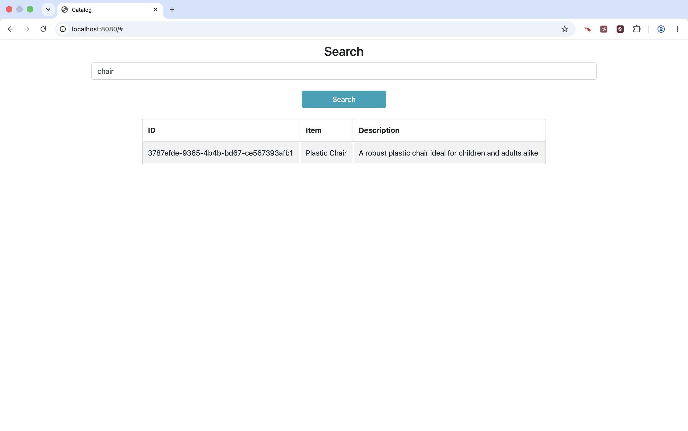
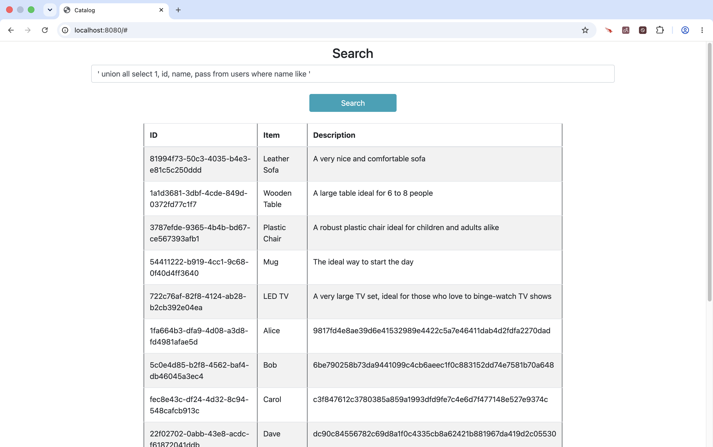
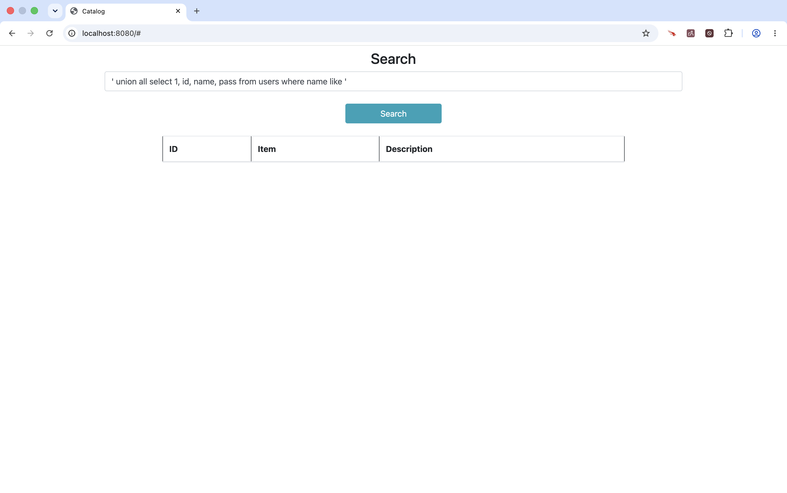

<!-- Generated by Sociable Weaver (https://github.com/albertattard/sw). Manual edits will be overwritten when regenerated. -->

# SQL Injection

This example traces a browser search term across the trust boundary into an
in-memory H2 database. The vulnerable repository concatenates that untrusted
value into a `LIKE` clause, allowing an attacker to alter the SQL and return
rows from a `users` table that the catalogue interface was never intended to
expose.

The safer repository uses a `PreparedStatement`: it keeps the SQL structure
separate from the search value, so the database treats the value as data. The H2
database, accounts, and hashes are workshop-only fixtures; none is a
production-ready configuration or credential pattern.

The Open Worldwide Application Security Project (OWASP) continues to regard SQL
Injection as an important attack vector that modern applications must actively
defend against. SQL Injection is included within
[**A05:2025 - Injection** in the OWASP Top 10](https://owasp.org/Top10/2025/A05_2025-Injection/),
which identifies the most critical security risks facing web applications.
Although OWASP characterizes SQL Injection as occurring at a lower frequency
than some other injection vulnerabilities, it emphasizes its
**high potential impact**, with more than 14,000 associated CVEs. A successful
SQL Injection attack can enable an attacker to access, modify, or delete
sensitive database information and, in some circumstances, compromise additional
parts of the underlying system. OWASP therefore recommends designing database
access so that untrusted input is kept separate from SQL commands, principally
through prepared statements and parameterized queries, supported by appropriate
server-side input validation.

---

## Disclaimer

The examples provided in this repository are for **educational purposes only**
and are intended to be used **exclusively within this workshop**. While every
effort has been made to ensure accuracy and reliability, these examples are
provided **“as is”**, without any warranties, express or implied.

By using these examples, you acknowledge that you do so **at your own risk**.
The authors and contributors shall **not be held liable** for any direct,
indirect, incidental, or consequential damages resulting from the use, misuse,
or inability to use these examples.

It is the responsibility of the user to **review, test, and validate** any code
before applying it in a production or commercial environment.

### Performance Disclaimer

The performance values shown in this workshop are for reference only and should
not be treated as absolute. Results can vary depending on hardware, system
configuration, runtime environment, and other factors. Readers are encouraged to
conduct their own tests under controlled conditions to obtain accurate
measurements relevant to their specific use case.

---

## Learning objectives

By the end of this example, attendees can:

- identify the browser-to-database trust boundary in the catalogue search;
- trace how concatenation lets a search value change the SQL statement;
- demonstrate the data leak in the vulnerable profile and verify that parameter
  binding blocks it; and
- explain why parameter binding does not replace least-privilege database access
  and review.

## Prerequisites

- [Oracle Java 25 or newer](https://www.oracle.com/java/technologies/downloads/#java25)

- `curl` available on your PATH

- A modern web browser to submit the two search terms. The Maven Wrapper is
  included, so a separate Maven installation is not required.

## The program to inspect

The application seeds a catalogue for the UI and a separate `users` table. The
catalogue search is not authorised to reveal that table; it is the failure
target used to make the consequence of SQL injection visible.

```sql
CREATE TABLE users (
    id      VARCHAR(40) NOT NULL,
    name    VARCHAR(40) NOT NULL,
    pass    VARCHAR(56) NOT NULL,
    PRIMARY KEY (id)
);

INSERT INTO users (id, name, pass) VALUES
  ('1fa664b3-dfa9-4d08-a3d8-fd4981afae5d', 'Alice', '9817fd4e8ae39d6e41532989e4422c5a7e46411dab4d2fdfa2270dad'),
  ('5c0e4d85-b2f8-4562-baf4-db46045a3ec4', 'Bob',   '6be790258b73da9441099c4cb6aeec1f0c883152dd74e7581b70a648'),
  ('fec8e43c-df24-4d32-8c94-548cafcb913c', 'Carol', 'c3f847612c3780385a859a1993dfd9fe7c4e6d7f477148e527e9374c'),
  ('22f02702-0abb-43e8-acdc-f61872041ddb', 'Dave',  'dc90c84556782c69d8a1f0c4335cb8a62421b881967da419d2c05530'),
  ('86eff67e-ea89-4adb-baff-babd20525f93', 'Ella',  '90abb2b597fde9552143f564ae0a247b11983f74ef836be504e7d808'),
  ('3182d1b4-da6b-4241-9615-29cc7a994f4f', 'Frank', '5795c3d628fd638c9835a4c79a55809f265068c88729a1a3fcdf8522'),
  ('57c2d9ac-c6a8-4c25-8b21-e195d7be044c', 'Gina',  '9c5f9835aa7ba0f4dd9ecb265277ee59c39016492b26c63371573481'),
  ('66745ec2-c19e-48aa-b4cd-b5fa8ffe953b', 'Harry', '64f977868a7a63bb65ddcd10c587b50ad21fe885fe667c99acc5d6f1'),
  ('d3ccb984-e394-4d1d-b58b-0ad93cf493be', 'Ivy',   '94cc697550f5c7399d179e206cf1e7bf90e17de8a87ff0f9368ec839'),
  ('9a595dd8-24e9-42a1-8efc-0ac96cdb7f7e', 'Jerry', '026727ec105a060b02a0086a2181748f6b9ac3cea3fc347ca8675984');
```

In the vulnerable implementation, `searchTerm` originates in a browser form and
is concatenated into query syntax before it reaches `Statement.executeQuery`. The
attacker can close the quoted `LIKE` value and add a compatible `UNION ALL`
result set.

```java
public List<CatalogueItem> search(final String searchTerm) {
    final String query = """
            select ID, GUID, CAPTION, DESCRIPTION
            from catalogue_item
            where DESCRIPTION like '%""" + searchTerm + "%'";

    try (Connection connection = dataSource.getConnection();
         Statement statement = connection.createStatement();
         ResultSet rs = statement.executeQuery(query)) {

        final List<CatalogueItem> result = new ArrayList<>();
        while (rs.next()) {
            result.add(new CatalogueItem(
                    rs.getLong(1),
                    UUID.fromString(rs.getString(2)),
                    rs.getString(3),
                    rs.getString(4)));
        }
        return result;
```

The fixed profile retains the same feature but prepares a statement with a
placeholder and binds the search term separately. The database parses the
statement structure before it sees the value, which prevents the value from
becoming SQL syntax.

```java
public List<CatalogueItem> search(String searchTerm) {
    final String query = """
            select ID, GUID, CAPTION, DESCRIPTION
            from catalogue_item
            where DESCRIPTION like ?""";

    try (Connection connection = dataSource.getConnection();
         PreparedStatement statement = connection.prepareStatement(query)) {

        statement.setString(1, "%" + searchTerm + "%");

        try (ResultSet rs = statement.executeQuery()) {
            final List<CatalogueItem> result = new ArrayList<>();
            while (rs.next()) {
                result.add(new CatalogueItem(
                        rs.getLong(1),
                        UUID.fromString(rs.getString(2)),
                        rs.getString(3),
                        rs.getString(4)));
            }
            return result;
```

## References

- [OWASP SQL Injection Prevention Cheat Sheet](https://cheatsheetseries.owasp.org/cheatsheets/SQL_Injection_Prevention_Cheat_Sheet.html)
- [OWASP Top 10: Injection](https://owasp.org/Top10/A05_2025-Injection/)
- [Java `PreparedStatement` API](https://docs.oracle.com/en/java/javase/25/docs/api/java.sql/java/sql/PreparedStatement.html)

## Guided walkthrough

Run these commands from this example directory. They start only local processes
and use the in-memory database; they do not change browser, host, or
database-server configuration.

1. Build the application.

   A successful Maven build produces `target/sql_injection-1.0.0.jar`, which
   both profiles reuse.

   ```shell
   ./mvnw clean package
   ```

   (*Optional*) Verify that the application was created.

   ```shell
   tree --dirsfirst --sort=name -L 1 --prune './target'
   ```

   The packaged Spring Boot JAR and the original thin JAR.

   ```
   ./target
   ├── sql_injection-1.0.0.jar
   └── sql_injection-1.0.0.jar.original

   1 directory, 2 files
   ```

2. Start the vulnerable default profile and wait until its local HTTP endpoint
   is ready. The PID file makes the following cleanup command safe to rerun
   after a normal start.

   ```shell
   java -jar './target/sql_injection-1.0.0.jar' > './target/sql-injection.log' 2>&1 &
   echo $! > './target/sql-injection.pid'

   # Wait for the application to start
   until curl -sf http://localhost:8080 >/dev/null; do sleep 1; done
   ```

3. Exploit the vulnerability.

   Open [http://localhost:8080](http://localhost:8080). First search for
   `chair`; this is the baseline evidence that the page behaves as a catalogue
   filter.

   

   Then submit this payload, including its surrounding single quotes:

   ```text
   ' union all select 1, id, name, pass from users where name like '
   ```

   The page should render rows derived from `users`: names appear as catalogue
   captions and password hashes appear as descriptions.

   

   This is evidence of the trust-boundary failure, not approval to deploy the
   application or its fixture data.

4. Stop the vulnerable process before starting the fixed profile.

   ```shell
   kill "$(cat 'target/sql-injection.pid')" 2>/dev/null || true
   rm -f 'target/sql-injection.pid'
   ```

5. Add a regression test.

   Turn the observed vulnerability into an automated test. The supplied test
   defines the required safe behaviour: the injection payload must return no
   catalogue rows. It is expected to fail with the vulnerable default profile
   and pass after the fixed profile selects the parameterised repository.

   Copy the provided test fixture into the project.

   ```shell
   rsync --archive 'fixtures/' './'
   ```

   Build with the default profile. The injected `CatalogueRepository` is the
   vulnerable implementation, so the regression test must fail: it exposes the
   defect rather than proving the application is safe.

   ```shell
   ./mvnw clean package
   ```

   The injection regression test fails, so Maven reports a build failure.

   ```
   ...
   [ERROR] Failures:
   [ERROR]   CatalogueRepositoryTest.returnAnEmptyListAsNothingMatchesTheInjection:30
   Expecting empty but was: [CatalogueItem[id=1, guid=81994f73-50c3-4035-b4e3-e81c5c250ddd, caption=Leather Sofa, description=A very nice and comfortable sofa],
       CatalogueItem[id=2, guid=1a1d3681-3dbf-4cde-849d-0372fd77c1f7, caption=Wooden Table, description=A large table ideal for 6 to 8 people],
       CatalogueItem[id=3, guid=3787efde-9365-4b4b-bd67-ce567393afb1, caption=Plastic Chair, description=A robust plastic chair ideal for children and adults alike],
       CatalogueItem[id=4, guid=54411222-b919-4cc1-9c68-0f40d4ff3640, caption=Mug, description=The ideal way to start the day],
       CatalogueItem[id=5, guid=722c76af-82f8-4124-ab28-b2cb392e04ea, caption=LED TV, description=A very large TV set, ideal for those who love to binge-watch TV shows],
       CatalogueItem[id=1, guid=1fa664b3-dfa9-4d08-a3d8-fd4981afae5d, caption=Alice, description=9817fd4e8ae39d6e41532989e4422c5a7e46411dab4d2fdfa2270dad],
       CatalogueItem[id=1, guid=5c0e4d85-b2f8-4562-baf4-db46045a3ec4, caption=Bob, description=6be790258b73da9441099c4cb6aeec1f0c883152dd74e7581b70a648],
       CatalogueItem[id=1, guid=fec8e43c-df24-4d32-8c94-548cafcb913c, caption=Carol, description=c3f847612c3780385a859a1993dfd9fe7c4e6d7f477148e527e9374c],
       CatalogueItem[id=1, guid=22f02702-0abb-43e8-acdc-f61872041ddb, caption=Dave, description=dc90c84556782c69d8a1f0c4335cb8a62421b881967da419d2c05530],
       CatalogueItem[id=1, guid=86eff67e-ea89-4adb-baff-babd20525f93, caption=Ella, description=90abb2b597fde9552143f564ae0a247b11983f74ef836be504e7d808],
       CatalogueItem[id=1, guid=3182d1b4-da6b-4241-9615-29cc7a994f4f, caption=Frank, description=5795c3d628fd638c9835a4c79a55809f265068c88729a1a3fcdf8522],
       CatalogueItem[id=1, guid=57c2d9ac-c6a8-4c25-8b21-e195d7be044c, caption=Gina, description=9c5f9835aa7ba0f4dd9ecb265277ee59c39016492b26c63371573481],
       CatalogueItem[id=1, guid=66745ec2-c19e-48aa-b4cd-b5fa8ffe953b, caption=Harry, description=64f977868a7a63bb65ddcd10c587b50ad21fe885fe667c99acc5d6f1],
       CatalogueItem[id=1, guid=d3ccb984-e394-4d1d-b58b-0ad93cf493be, caption=Ivy, description=94cc697550f5c7399d179e206cf1e7bf90e17de8a87ff0f9368ec839],
       CatalogueItem[id=1, guid=9a595dd8-24e9-42a1-8efc-0ac96cdb7f7e, caption=Jerry, description=026727ec105a060b02a0086a2181748f6b9ac3cea3fc347ca8675984]]
   [INFO]
   [ERROR] Tests run: 2, Failures: 1, Errors: 0, Skipped: 0
   [INFO]
   [INFO] ------------------------------------------------------------------------
   [INFO] BUILD FAILURE
   [INFO] ------------------------------------------------------------------------
   ...
   ```

   Build again with the `fixed` Spring profile. Spring now injects the
   `CatalogueRepositoryFixed` implementation, which uses a `PreparedStatement`
   to bind the search term as data.

   ```shell
   ./mvnw clean package -Dspring.profiles.active=fixed
   ```

   The same regression test now passes because the payload cannot alter the SQL
   statement.

   ```
   ...
   [INFO] ------------------------------------------------------------------------
   [INFO] BUILD SUCCESS
   [INFO] ------------------------------------------------------------------------
   ...
   ```

   Keeping both implementations is deliberate workshop scaffolding, not a
   production pattern. In production, remove the vulnerable implementation,
   retain the regression test, and review database permissions and query
   construction before release. A passing test is evidence for this payload; it
   is not deployment approval.

6. Start the application using the `fixed` profile.

   It supplies the same user experience while selecting
   `CatalogueSqlRepositoryFixed`.

   ```shell
   java \
     -jar './target/sql_injection-1.0.0.jar' \
     --spring.profiles.active=fixed \
     > 'target/sql-injection-fixed.log' 2>&1 &
   echo $! > 'target/sql-injection-fixed.pid'

   # Wait for the application to start
   until curl -sf http://localhost:8080 >/dev/null; do sleep 1; done
   ```

7. Verify that the problem has been addressed.

   Submit the same payload to [http://localhost:8080](http://localhost:8080).

   ```text
   ' union all select 1, id, name, pass from users where name like '
   ```

   The page should not expose `users` rows; the payload is now a literal search
   value.

   

   The relevant SQL shape is `where DESCRIPTION like ?`, with the wildcarded
   search string supplied as a bound value.

8. Stop the fixed process when finished.

   ```shell
   kill "$(cat 'target/sql-injection-fixed.pid')" 2>/dev/null || true
   rm -f 'target/sql-injection-fixed.pid'
   ```

## Key takeaways and residual risk

- Concatenating the browser-supplied search term let it change the SQL statement
  and expose rows outside the catalogue’s intended result set.
- `PreparedStatement` parameter binding keeps query structure and untrusted
  values separate, preventing this injection payload from becoming SQL syntax.
- Parameter binding is necessary but not sufficient: use a database account with
  only the permissions the feature needs, so a future injection defect has a
  smaller blast radius.
- A successful local demonstration is evidence that this payload is blocked in
  this example; a human still must review query construction, authorisation, and
  operational database permissions before release.
